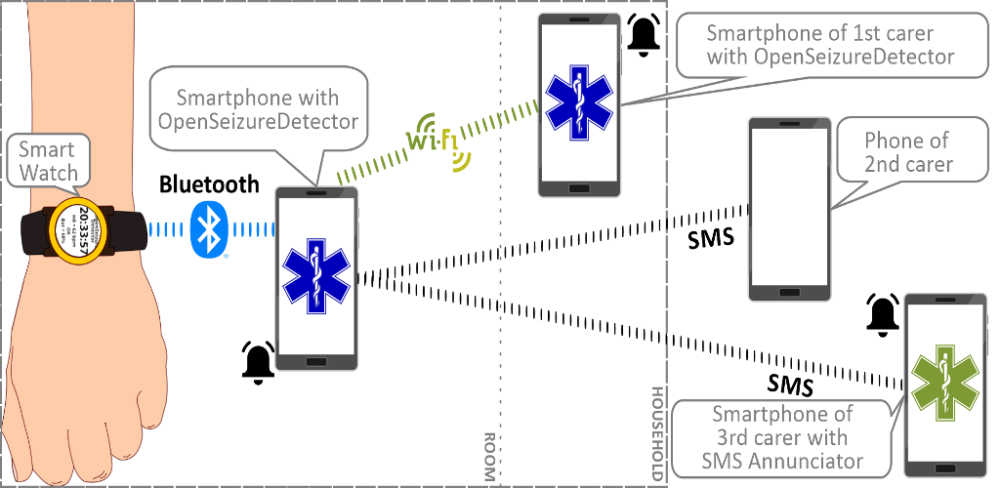

# OpenSeizureDetector

Open Seizure Detector is a system to detect a tonic-clonic epileptic seizure and raise an alarm to warn a carer that the user may need assistance.  

It uses a smart-watch and an Android phone to monitor the movement and heart rate of the user to detect possible seizures.

It is our intention to be able to detect seizures on the lowest cost hardware possible, so that the system is available to as many people as possible.

## How OpenSeizureDetector Works
It uses a smart watch running custom software to:
  - Measure movement (acceleration) of the arm.
  - Measure heart rate
  - Send the data to an Android phone for analysis

The android phone:
  - Analyses the user's movement to detect if the movement is consistent with a seizure.
  - Analyses the user's heart rate to identify abnormal heart rate.
  - Raises an alarm if the movment or heart rate are consistent with a seizure by:
      - Generating an alarm sound from the phone.
      - (optionally) sending an SMS text meassage to selected phone numbers
      - (optionally) generating alarm sounds from other devices connected over wifi.
      - (optionally) upload data to be included anonymously in the Open Seizure Database which will be used to improve the seizure detection algorithms.
 

## Compatible Devices

### Phone
The OpenSeizureDetector app itself should run on any Android device that runs Android Version 5 or later.   This includes the light weight Android Go edition.

If you are using a Garmin watch (see the section on [watches](#watch) below), the phone needs to be able to run the Garmin Connect app to interface with the watch, which requires Android V7 or later.

### Watch
The current options for the watch are:
  - Garmin (e.g. VenuSQ2) - very good heart rate monitor, but expensive.
  - PineTime - Very low cost (~£35 imported into UK).  Heart rate monitor reasonable, but not as good as Garmin.
  - BangleJs2 - Intermediate cost.  Good accelerometer but poor heart rate monitor performance.
  )

# More Details
  - [Project Goals](./pages-about/goals.html)
  - [Installation and Usage Instructions](./pages-user/installation.html)
  - [Developer Documentation](./pages-developer/index.html)

[Markdown Examples](./markdown_examples.html)