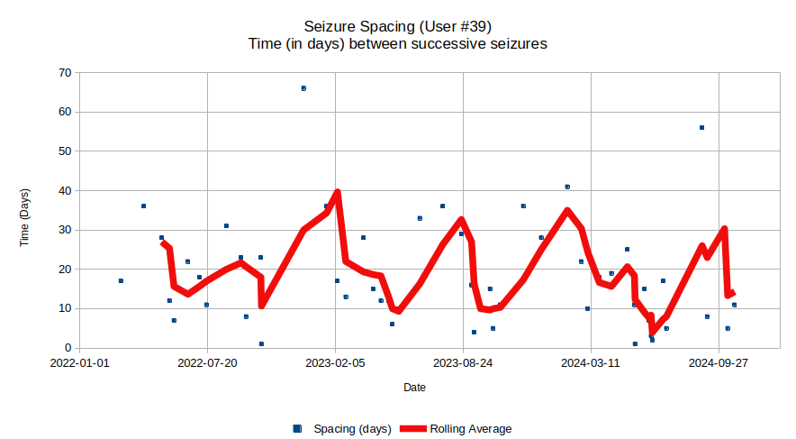

# Introduction
We developed OpenSeizureDetector (OSD) for our son, Benjamin to detect notcturnal tonic-clonic seizures.   He uses the seizure detector whenever he is in his bedroom alone and sometimes when he is in the bathroom, but does not wear it for his day time activities when he is always with a carer so does not need a seizure detector.

We have recorded all of his seizures and false alarms since we introduced the Data Sharing feature of OpenSeizureDetector in 2022 so we now have over 18 months of data available to allow us to assess the 'real world' performance of the system for one particular user over an extended period.

# Methodology

This analysis is based on Version 1.7 of the [Open Seizure Database](https://www.openseizuredetector.org.uk/?page_id=1818), with the data of this one particular user extracted from the .csv index files (rather than analysing the large .json files containing the raw data).

The 'All Seizures' data includes some seizures were not identified by OSD, but by observation of unusual sounds or posture via a video monitor.    This means it is possible that there were more seizures than were recorded in the database if both OSD and the manual observation missed them.  However from experience the vast marjority of seizures occur on waking so we are accustomed to listening for unusual sounds around waking time, so believe that the number of missed seizures will be low.

The 'All Seizures' file was used to determine whether OpenSeizureDetector had correctly identified each seizure or not, so the detection reliability can be calculated  The False Alarms file was used to determine the false alarm rate (false alarms per day).   These calculations were performed by importing the Open Seizure Database Index .csv files into [LibreOffice](https://libreoffice.org) Calc and using a combination of pivot tables and simple formulae.

The analysis is complicated by a number of changes to OSD and the algorithm used during the period analysed - it had been realised that Benjamin was having a larger number of less severe seizures that often involved a low frequency 'flapping' movement of the arm and the OSD algorithm was not good at picking these up so some changes were made to improve performance over the period analysed.

# Results

## Detection Reliability

## False Alarm Rate

# Discussion

# Conclusion

see [watch-comparison.html](./watch-comparison.html) for a comparison of the current status of development of OpenSeizureDetector for various devices

## Open Seizure Database