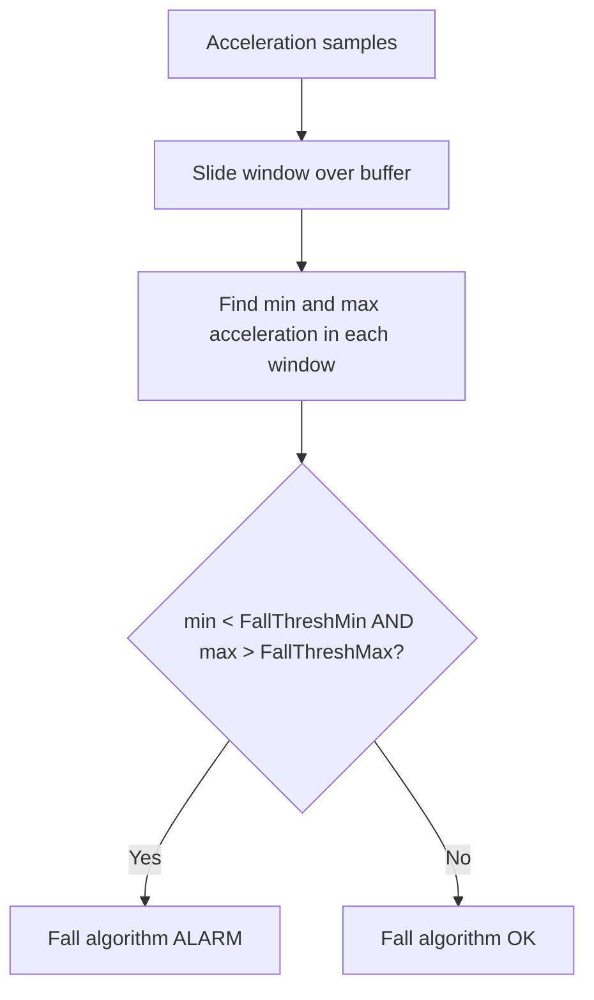
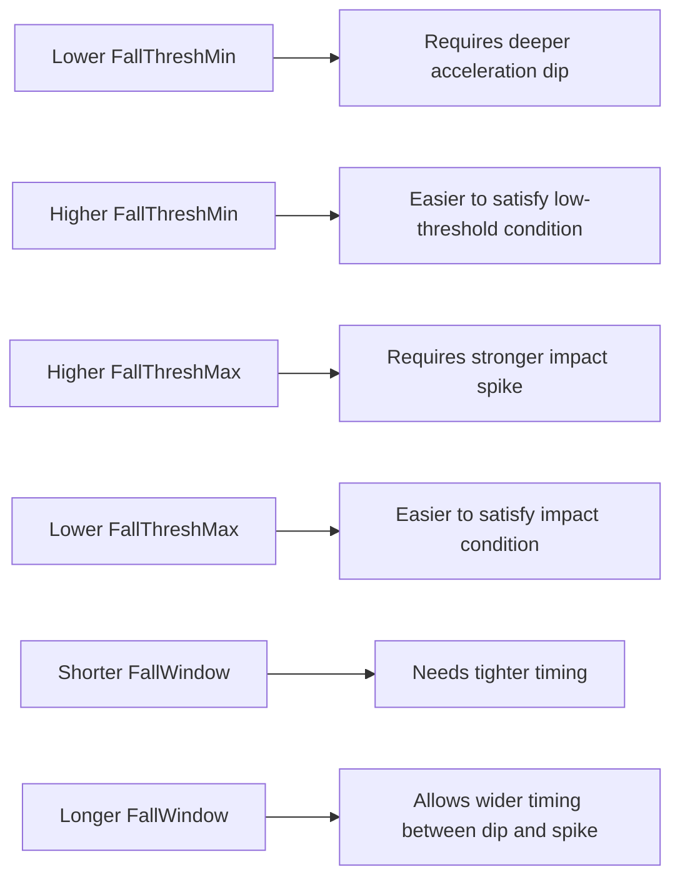

# Fall Detection

Fall Detection looks for a rapid low-then-high acceleration pattern inside a short time window.
It is designed to detect acute fall-like events and trigger quickly.

## How it works

For each analysis cycle, the algorithm scans sliding windows and checks whether both conditions occur in the same window:

1. A low acceleration dip below FallThreshMin (free-fall-like phase)
2. A high acceleration peak above FallThreshMax (impact-like phase)

If both are true in the configured window, the fall algorithm raises ALARM.

## User settings

| Setting | What it changes |
|---|---|
| FallActive | Enables or disables Fall Detection. |
| FallThreshMin | Lower acceleration threshold that represents the free-fall-like part. |
| FallThreshMax | Upper acceleration threshold that represents the impact-like part. |
| FallWindow | Time window in milliseconds in which both threshold crossings must occur. |

## Practical tuning effect

## Alarm behavior note

In current app logic, a detected fall bypasses normal voting and warning-time delays and can force an immediate ALARM state. This is intentional so that possible falls get rapid attention.
