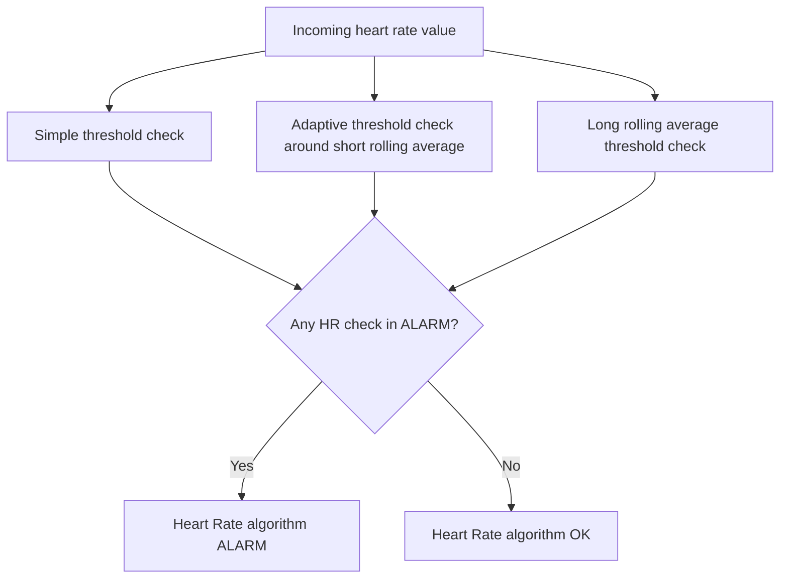
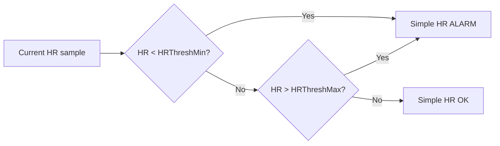
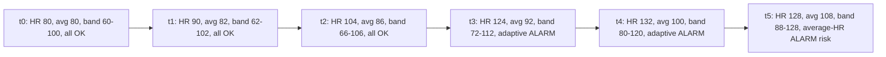
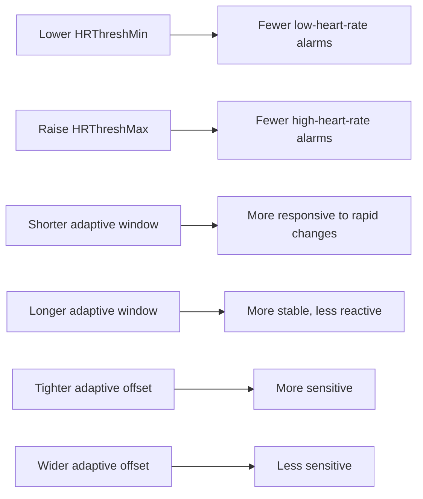

# Heart Rate Alarms

Heart Rate alarms use measured heart rate values to detect abnormal physiology patterns.
The app supports three heart-rate checks that can run together.

## How it works

The Heart Rate detector is made of three separate checks that can run in parallel:

- Simple threshold: alarms if current heart rate is below minimum or above maximum.
- Adaptive threshold: compares current heart rate against a short rolling average plus or minus an offset.
- Rolling average threshold: alarms if the longer rolling average is outside configured limits.

## Technical description of each algorithm

### 1. Simple threshold algorithm

This is the direct high/low bpm check.

- Input: current heart rate sample.
- Alarm condition: current HR < HRThreshMin or current HR > HRThreshMax.
- Best use: clear hard limits, for example very high tachycardia or very low bradycardia.

### 2. Adaptive threshold algorithm

This tracks a short rolling average and creates a moving alarm band around it.

- Input: current HR and short-window average.
- Dynamic limits:
  - lower limit = adaptive_average - HRAdaptiveAlarmThresh
  - upper limit = adaptive_average + HRAdaptiveAlarmThresh
- Alarm condition: current HR outside the dynamic limits.
- Best use: detect rapid changes relative to recent baseline, not just fixed absolute values.

### 3. Average HR algorithm

This monitors a longer rolling average and compares that average against fixed limits.

- Input: long-window rolling average.
- Alarm condition: average HR < HRAverageAlarmThreshMin or average HR > HRAverageAlarmThreshMax.
- Best use: sustained physiological drift rather than brief spikes.

## Example: rising HR during a seizure-like event

The table below shows how the adaptive threshold band moves upward as HR rises, while still detecting a rapid jump.

Assumed settings in this example:

- HRAdaptiveAlarmThresh = 20 bpm
- HRThreshMax = 140 bpm
- HRAverageAlarmThreshMax = 115 bpm

| Time point | Current HR | Adaptive average | Adaptive band (avg +/- 20) | Simple threshold | Adaptive threshold | Average HR |
|---|---:|---:|---|---|---|---|
| t0 (rest) | 80 | 80 | 60 to 100 | OK | OK | OK |
| t1 | 90 | 82 | 62 to 102 | OK | OK | OK |
| t2 | 104 | 86 | 66 to 106 | OK | OK | OK |
| t3 (rapid rise) | 124 | 92 | 72 to 112 | OK | ALARM | OK |
| t4 | 132 | 100 | 80 to 120 | OK | ALARM | WARNING trend |
| t5 (sustained high) | 128 | 108 | 88 to 128 | OK | borderline/OK | ALARM |

Interpretation:

- Simple threshold reacts only when fixed min or max limits are crossed.
- Adaptive threshold reacts early to fast changes, then its band follows the trend.
- Average HR reacts later, but is strong for prolonged elevation.

## User settings

| Setting | What it changes |
|---|---|
| HRAlarmActive | Enables or disables Heart Rate alarms. |
| HRThreshMin | Lower bpm threshold for the simple heart-rate check. |
| HRThreshMax | Upper bpm threshold for the simple heart-rate check. |
| HRAdaptiveAlarmActive | Enables adaptive threshold mode. |
| HRAdaptiveAlarmWindowSecs | Rolling-average window length used by adaptive mode. |
| HRAdaptiveAlarmThresh | Offset above and below the adaptive rolling average that triggers alarm. |
| HRAverageAlarmActive | Enables long rolling-average threshold mode. |
| HRAverageAlarmWindowSecs | Window length for long rolling-average mode. |
| HRAverageAlarmThreshMin | Lower limit for the long rolling average. |
| HRAverageAlarmThreshMax | Upper limit for the long rolling average. |
| HRNullAsAlarm | If enabled, missing or invalid heart-rate readings are treated as alarm. |
| HrFrozenAlarm | Raises a fault warning if heart-rate values appear frozen for too long. |

## Practical tuning effect

## Important data-source note

Heart-rate detection quality depends on watch sensor quality and data continuity.
In practical use, Garmin devices generally provide the most reliable continuous heart-rate data.
