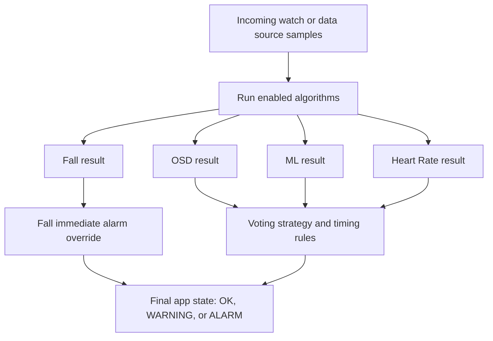
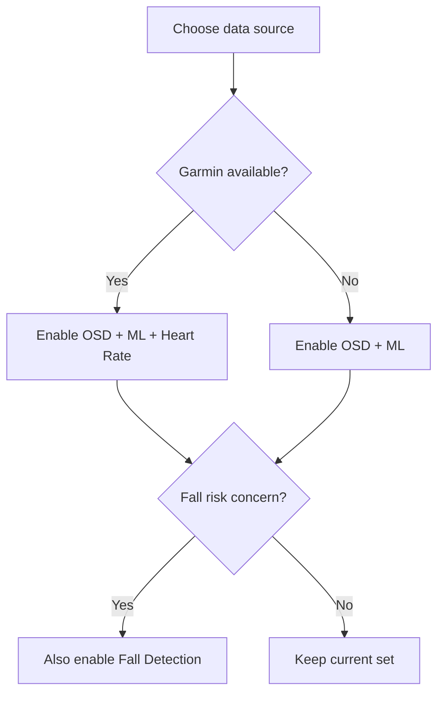

# Seizure Detection Algorithms

OpenSeizureDetector can run more than one detection algorithm at the same time.
This section explains what each algorithm does and which settings you can tune.

- [Original OSD Algorithm](original-osd-algorithm.html)
- [Machine Learning (ML) Algorithm](machine-learning-ml-algorithm.html)
- [Heart Rate Alarms](heart-rate-alarms.html)
- [Fall Detection](fall-detection.html)

## How decisions are made

In normal operation, the app processes incoming data in analysis cycles and then combines algorithm outputs.

## Where to configure algorithms in the app

1. Open the main screen menu (three dots).
2. Tap Settings.
3. Open Seizure Detector.
4. Use Seizure Detection Algorithms Selection to enable or disable algorithms.
5. Open Algorithm Settings to tune thresholds and timing.

## Quick guidance

- Start with defaults unless you already know you need different sensitivity.
- Change one setting at a time, then monitor behavior for several days.
- If false alarms increase after a change, revert that change before trying another.

## High-level comparison

Use this as a practical guide when choosing which algorithms to enable.

| Algorithm | Main signal used | Best at detecting | Typical strengths | Typical limitations | Key settings to tune |
|---|---|---|---|---|---|
| Original OSD | Wrist accelerometer frequency pattern | Rhythmic tonic-clonic type movement | Proven and transparent logic, works well for sustained rhythmic motion | Can false-alarm on repetitive non-seizure movement (for example brushing teeth or washing dishes) | AlarmFreqMin, AlarmFreqMax, AlarmThresh, AlarmRatioThresh |
| Machine Learning (ML) | Accelerometer waveform features learned by model(s) | Complex movement patterns captured by trained models | Often better balance of sensitivity vs false alarms, supports multiple models | Depends on model quality and thresholds, may need periodic tuning | MlSeizureProbabilityThresholdPct, MlAccelStdThresholdPct, model selection |
| Heart Rate Alarms | Heart rate trend and thresholds | Abnormal heart-rate events, including rapid changes or sustained abnormal rates | Adds physiological signal independent of movement pattern | Needs reliable continuous HR source, can alarm from non-seizure causes of HR change | HRThreshMin/Max, adaptive and average window/threshold settings |
| Fall Detection | Short-window acceleration min/max event pattern | Acute fall-like events (free-fall plus impact sequence) | Fast response to sudden fall-like events | Crude by design, can false-alarm on abrupt non-fall movements | FallThreshMin, FallThreshMax, FallWindow |

## Choosing a starting combination

- PineTime users: start with Original OSD + ML.
- Garmin users: start with Original OSD + ML + Heart Rate.
- Fall risk concern: enable Fall Detection in addition to your normal seizure-detection algorithms.

