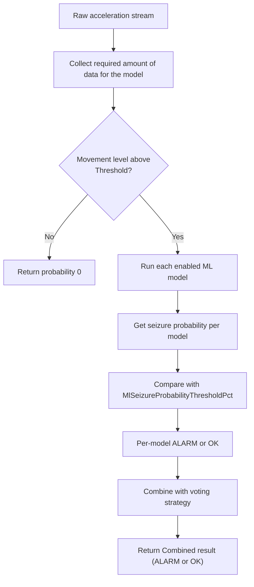
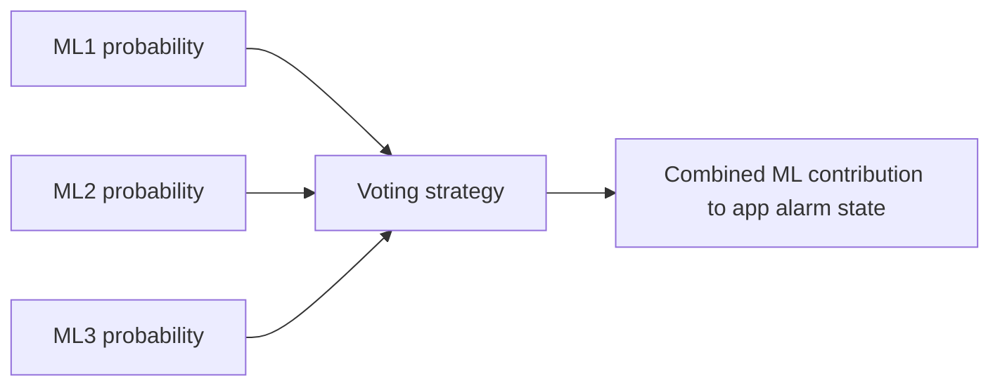

# Machine Learning (ML) Algorithm

The ML algorithm estimates seizure probability from recent motion data using installed ML models.
In current app versions, multiple ML models can be installed and run.

## How it works

The app feeds recent acceleration data into one or more ML models and uses model output probabilities.

## User settings

| Setting | What it changes |
|---|---|
| CnnAlarmActive | Enables or disables ML detection. |
| MlAccelStdThresholdPct | Minimum movement variability required before ML inference is considered meaningful. Lower values make ML run in calmer motion; higher values suppress low-motion triggers. |
| MlSeizureProbabilityThresholdPct | Probability threshold above which a model reports ALARM. Lower values increase sensitivity; higher values reduce alarms. |
| MlModelUpdateCheckPeriod | How often the app checks for model updates (Never, Daily, Weekly, Monthly). |
| Add ML Model | Downloads and installs an additional model package. |

## Voting and multiple models

When more than one model is active, the app can combine model outputs using the selected voting strategy.

## Practical tuning effect

- Lower MlSeizureProbabilityThresholdPct: catches more possible events, but may increase false alarms.
- Higher MlSeizureProbabilityThresholdPct: fewer false alarms, but may miss subtle events.
- Lower MlAccelStdThresholdPct: ML evaluates more often, including low-motion periods.
- Higher MlAccelStdThresholdPct: ML ignores low-motion windows, reducing sensitivity in mild activity.

## Notes

- Model metadata can provide recommended thresholds when models are installed.
- If you manually tune thresholds, your user-set values are retained.

# Available Models

## DeepEpiCnn_Run24
