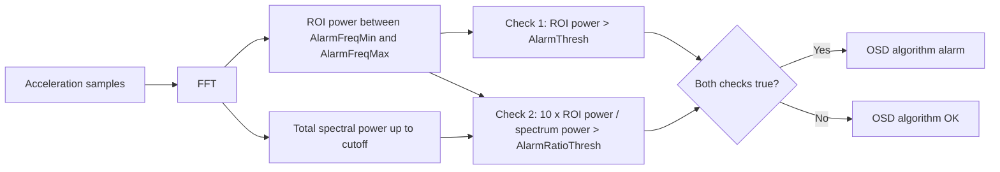
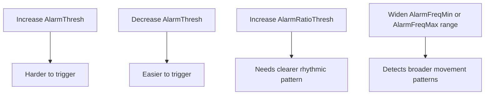
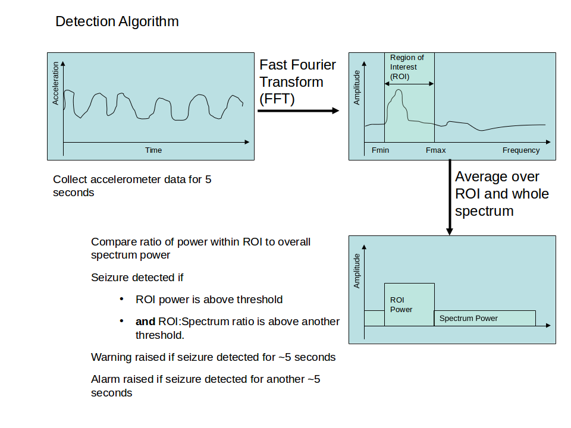
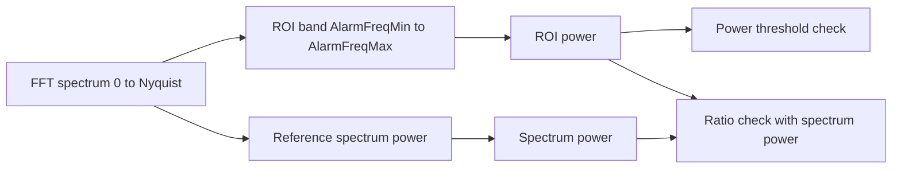
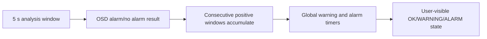
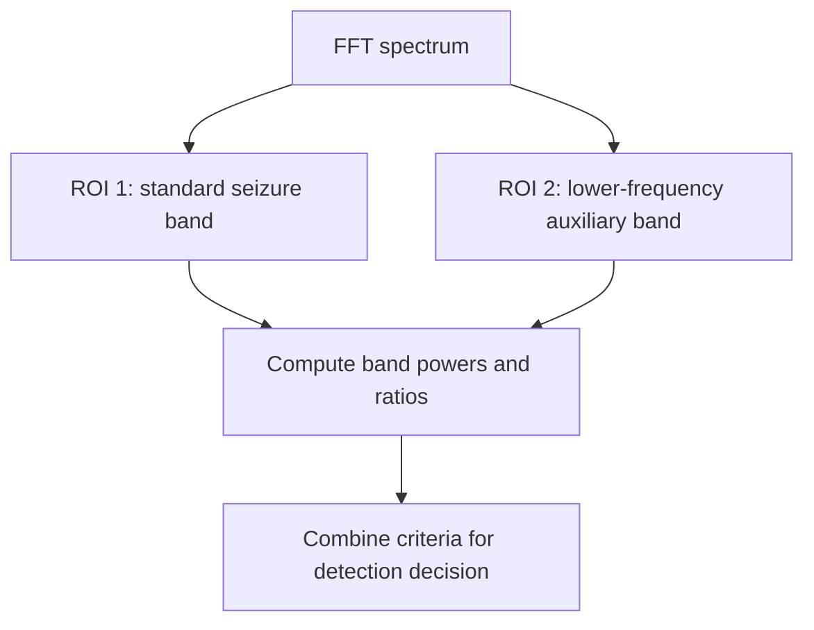

# Original OSD Algorithm

The Original OSD algorithm looks for seizure-like rhythmic motion in accelerometer data.
It uses a frequency analysis approach and has been part of OpenSeizureDetector since the early versions.

## How it works

At a high level:

1. Collect a time window of acceleration samples.
2. Convert the signal into the frequency domain (FFT).
3. Measure power in a seizure-focused frequency band.
4. Compare that power and its ratio against thresholds.
5. Report an algorithm alarm when both threshold checks pass.

## User settings

These are the key settings you can tune in current Android app versions:

| Setting | What it changes |
|---|---|
| OsdAlarmActive | Enables or disables the Original OSD algorithm. |
| AlarmFreqMin | Lower edge of the target frequency band. Lower values make it more sensitive to slower rhythmic movement. |
| AlarmFreqMax | Upper edge of the target frequency band. Higher values include faster rhythmic movement. |
| AlarmThresh | Minimum movement power needed before OSD can trigger. Increasing it usually reduces sensitivity and false alarms. |
| AlarmRatioThresh | How concentrated movement must be in the target band. Higher values require a cleaner seizure-like frequency signature. |

## Practical tuning effect

## Typical when to adjust

- Too many alarms during repetitive daily movements: increase AlarmThresh or AlarmRatioThresh slightly.
- Missed events with slower rhythmic movement: lower AlarmFreqMin slightly.
- Missed events with faster rhythmic movement: raise AlarmFreqMax slightly.

For context and history of the frequency method, see the project notes at:
https://www.openseizuredetector.org.uk/?page_id=455

## Technical details

This section provides the detailed technical description of the OSD algorithm and design rationale.

### Algorithm sequence

The original OSD acceleration algorithm is described as:

1. Collect accelerometer data at 25 Hz for 5 seconds.
2. Run an FFT to convert the acceleration signal into frequency-domain bins.
3. Calculate average power in the Region Of Interest (ROI), typically 3-8 Hz.
4. Calculate average power in the overall spectrum (up to configured cutoff).
5. Calculate the ratio of ROI power to spectrum power.
6. Mark seizure-like movement when both checks pass:
   - ROI power above threshold
   - ROI/spectrum ratio above threshold
7. Raise warning/alarm states when seizure-like movement persists over consecutive analysis windows.

### Region Of Interest (ROI) diagram

Detection diagram:

{:target="_blank"}

Conceptually, the ROI check is:

### Why 25 Hz sampling was chosen

The sampling rationale compares watch sampling choices 10, 25, and 100 Hz.

- 10 Hz gives Nyquist 5 Hz, which is marginal for seizure movement expected around 5-10 Hz.
- 25 Hz gives Nyquist 12.5 Hz, covering the target movement band with moderate compute cost.
- 100 Hz gives Nyquist 50 Hz, but significantly increases data volume and processing cost.

With a 5 second analysis window:

- Frequency resolution is Delta f = 1/T = 1/5 = 0.2 Hz.
- Maximum detectable frequency is f_max = f_s/2 = 25/2 = 12.5 Hz.

This is why the design summary selected 25 Hz sampling with 5 second windows.

### Additional notes

- The algorithm documentation also describes an experimental multiple-ROI variant to improve detection of lower-frequency seizure movement (for example around 4 Hz).
- The documentation also notes expected FFT behavior, including strong low-frequency/DC components caused by gravity in accelerometer signals.

### What the design is trying to detect

The design targets sustained rhythmic movement typical of tonic-clonic seizure phases, with energy often concentrated in approximately the 5-10 Hz region.

Important assumptions:

- Motion axis is not known in advance, so acceleration channels are combined into a single motion signal for analysis.
- Detection is based on rhythmic structure over several seconds, not a single instantaneous spike.
- A secondary low-frequency objective (for example breathing-related motion) was discussed but not part of the standard seizure detector path.

### Sampling system and FFT trade-offs

The practical trade-off is between sampling frequency, maximum detectable frequency, and compute/data load.

| Sampling frequency | Nyquist (f_s/2) | Interpretation |
|---|---:|---|
| 10 Hz | 5 Hz | Considered borderline/too low for seizure motion around 5-10 Hz |
| 25 Hz | 12.5 Hz | Chosen compromise: covers target band with manageable processing |
| 100 Hz | 50 Hz | Plenty of bandwidth, but much higher data and compute load |

For a 5 second analysis window:

- Samples per window at 25 Hz: N = 25 x 5 = 125.
- Frequency resolution: Delta f = 1/T = 0.2 Hz.

This means the detector updates in discrete analysis windows (every 5 seconds), each with 0.2 Hz spectral bin spacing.

### Warning and alarm timing interpretation

Timing can be interpreted as:

- One analysis decision per 5 second window.
- Warning after persistent seizure-like windows over about 10 seconds.
- Alarm after additional persistent seizure-like windows.

In current app architecture, final app-level WARNING/ALARM timing is additionally controlled by Algorithm Voting timing settings (WarnTime and AlarmTime), so effective user-visible timing depends on both algorithm output persistence and global state-machine settings.

### Expected FFT behavior

Expected FFT-derived behavior:

| Observation | Why it happens | Practical implication |
|---|---|---|
| Strong DC or very low-frequency component | Accelerometer includes gravity offset | Low-frequency bins can dominate unless normalized/ratio-based checks are used |
| ROI band rises during rhythmic shaking | Seizure-like rhythmic motion concentrates energy in ROI | ROI power threshold is a primary detector gate |
| Ratio check improves specificity | Compares ROI concentration to broader spectrum | Helps reject broad-spectrum movement that is not seizure-like |

### Alternative multiple-ROI concept

The documentation also describes an alternative detector variant using more than one Region Of Interest (for example standard 3-8 Hz plus an additional lower-frequency band) to improve sensitivity for some partial or lower-frequency patterns.

This is presented as an experimental extension rather than the baseline default path.

### Historical context

The algorithm write-up was created in 2015 and updated in 2024 to better match Garmin/PineTime implementation while retaining the original sampling and FFT rationale.
