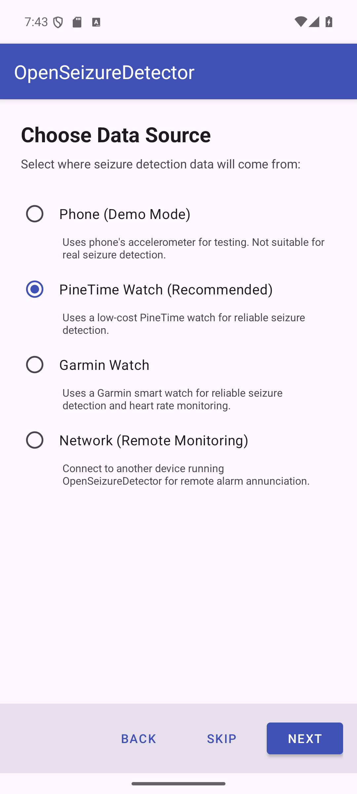

# Setting Up OpenSeizureDetector

This guide walks you through the complete setup of OpenSeizureDetector on your Android phone,
from installing the app to your first seizure-detection session.

---

## Before You Start

You will need:

- An **Android phone** running Android 8.0 or later
- A **data source** — choose one:
  - **PineTime watch** — low-cost (approx. £35), open-source, recommended for most users
  - **Garmin watch** — recommended if you need continuous heart rate monitoring
  - **A second phone or tablet** — to receive alarms remotely from an existing OSD installation
    (Network mode)

---

## Part 1 — Install the App

Install **OpenSeizureDetector** from the Google Play Store:

{:target="_blank"}

Or search for **"OpenSeizureDetector"** in the Play Store.

> **Important battery setting:** After installing, open your phone's **Settings** and search
> for **"Optimise Battery Usage"** (or Battery Optimisation). Find OpenSeizureDetector in the
> list and set it to **Not optimised** — otherwise Android may shut the app down in the
> background to save power.

---

## Part 2 — Setup Wizard

### Step 1 — Welcome Screen

When you first launch OpenSeizureDetector, the setup wizard starts automatically.

{:target="_blank"}

The wizard guides you through:

- Choosing your data source (the watch or remote device)
- Configuring the data source
- Selecting seizure detection algorithms

Press **Next** to continue, or **Skip** to configure manually via Settings later.

---

### Step 2 — Select Data Source

On the *Choose Data Source* screen, select the option that matches your setup.

{:target="_blank"}

| Option | Description |
|--------|-------------|
| Phone (Demo Mode) | Uses the phone accelerometer — for testing only, not real seizure detection |
| **PineTime Watch (Recommended)** | Low-cost wrist watch — reliable tonic-clonic seizure detection |
| **Garmin Watch** | Garmin smart watch — seizure detection plus heart rate monitoring |
| **Network (Remote Monitoring)** | Receives alarms from another OSD device on your Wi-Fi |

Press **Next** in the app to proceed to the data source configuration screen, then follow
the guide for your chosen source below.

---

### Step 3 — Configure Your Data Source

Press the button for your data source to open the configuration guide.
Each guide covers everything needed to get the data source working, then has a
**Back** button to return here.

  <a href="setup_pinetime.html" class="btn-datasource">
    ⌚
    PineTime Watch
    Recommended for most users
  </a>
  <a href="setup_garmin.html" class="btn-datasource">
    ⌚
    Garmin Watch
    Best for heart rate monitoring
  </a>
  <a href="setup_network.html" class="btn-datasource">
    📡
    Network Mode
    Remote alarm receiver
  </a>

> **Network mode users:** The wizard skips algorithm selection entirely (algorithms run on
> the primary device). After completing the network data source setup, jump straight to
> [Step 5 — Setup Complete](#step-5--setup-complete) below.

---

### Step 4 — Select Detection Algorithms

*(PineTime and Garmin users only.)*

After configuring your data source and pressing **Next** in the app, the wizard shows the
algorithm selection screen.

Choose which seizure detection algorithms to enable. You can select **more than one**.

{:target="_blank"}

| Algorithm | Description |
|-----------|-------------|
| **ML Algorithm (Recommended)** | Machine Learning / AI detection. Good sensitivity with fewer false alarms. Improves over time via community data sharing. [How it works and settings](../seizure-detection/machine-learning-ml-algorithm.html). |
| Heart Rate Alerts | Detects abnormal heart rate. Requires a Garmin watch for reliable HR measurement. [How it works and settings](../seizure-detection/heart-rate-alarms.html). |
| **OSD Algorithm** | Original proven algorithm. Good for overnight use; may false-alarm on repetitive movements (brushing teeth, washing dishes etc.). [How it works and settings](../seizure-detection/original-osd-algorithm.html). |
| OSD with Flap Detection | Enhanced OSD that also detects arm flapping — maximum night-time tonic-clonic detection. |

**At least one algorithm must be selected** before Next is enabled.

**Recommended choices:**

| Watch | Recommended algorithms |
|-------|------------------------|
| PineTime | ML Algorithm + OSD Algorithm |
| Garmin | ML Algorithm + Heart Rate Alerts + OSD Algorithm |

#### Algorithm configuration dialogs

After pressing Next, a short confirmation dialog appears for each enabled algorithm:

{:target="_blank"}

- **OSD Algorithm** — default settings applied automatically. Tap **OK**.
- **OSD with Flap Detection** — default settings applied. Tap **OK**.
- **ML Algorithm** — the recommended ML model is downloaded automatically. If no model is
  available, ML is gracefully disabled and can be re-enabled from Settings later.
- **Heart Rate Alerts** — default HR thresholds applied. Tap **OK**.
  You can fine-tune these thresholds in Settings after the wizard completes.

---

### Step 5 — Setup Complete

The final screen confirms your configuration.

{:target="_blank"}

The summary shows:

- **Data Source** — your watch name / Bluetooth address, or connection type
- **Enabled Algorithms** — the algorithms that will run

Press **Get Started** to launch the main monitoring screen.

---

## What Happens When You Start the App

After setup, each time you launch OpenSeizureDetector a **start-up screen** is shown.
This screen:

- Checks that all required permissions have been granted (Bluetooth, notifications, etc.)
- Requests any missing permissions
- Verifies the data source is reachable
- Shows connection status before handing over to the main screen

Once everything checks out, the app opens the **main monitoring screen** where live status
is displayed and seizure detection is active.

See [Using OpenSeizureDetector](../using-openseizuredetector-v5.html) for an overview of
using the app once it is set-up.

---

## Troubleshooting

| Problem | Solution |
|---------|----------|
| App closed by Android in background | Set OSD to *Not optimised* in your phone's Battery Optimisation settings |
| Wizard does not start on first launch | Open Settings in the app and tap *Run Setup Wizard* |
| Need to re-run setup | Open Settings in the app and tap *Run Setup Wizard* |

For more information visit [openseizuredetector.org.uk](https://openseizuredetector.org.uk)
