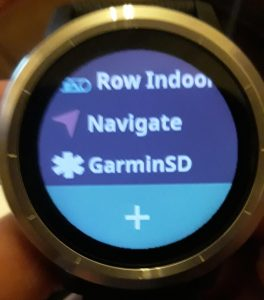
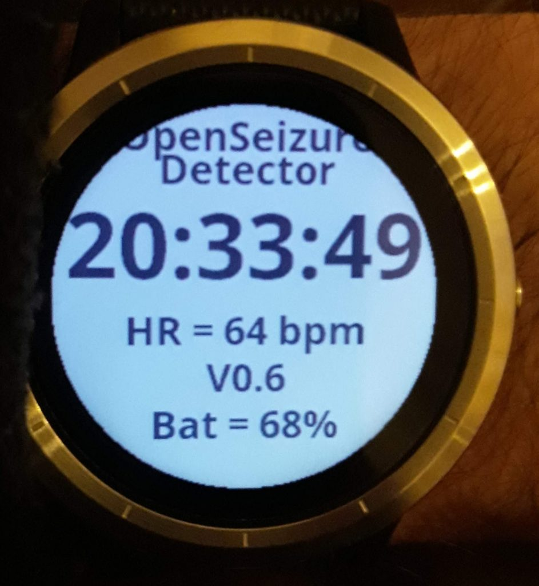
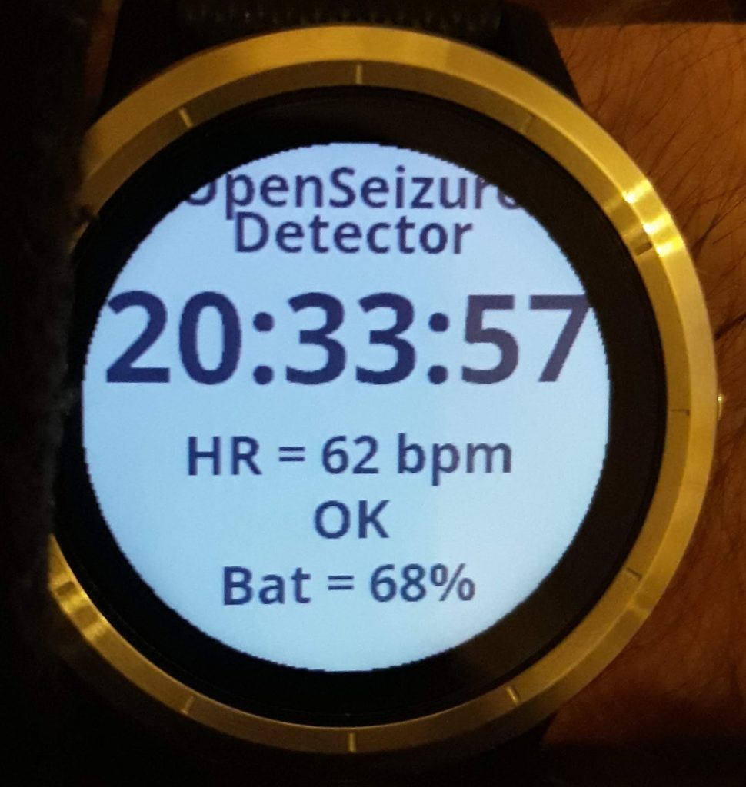
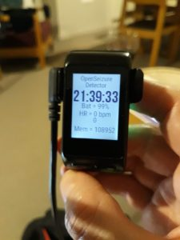
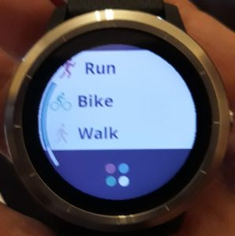

# Garmin Watch — Data Source Setup

<a href="index.html" class="btn-back">← Back to Main Setup Guide</a>

> **New users:** If you do not already own a Garmin watch, consider the low-cost
> (approx. £35) [PineTime watch](https://pine64.com/product/pinetime-smartwatch-sealed/)
> instead — it is cheaper and much easier to set up. The main reason to prefer Garmin is
> if you need the **heart rate alarm** feature, since Garmin HR sensors are significantly
> more reliable during vigorous movement.

This page covers configuring a **Garmin watch** as your data source (Step 3 of the setup
wizard). Garmin provides reliable tonic-clonic seizure detection and, unlike the PineTime,
also delivers accurate continuous heart rate monitoring.

You will need:
- A compatible Garmin watch (see [Compatible Devices](#compatible-devices) below)
- The **[Garmin Connect](https://play.google.com/store/apps/details?id=com.garmin.android.apps.connectmobile)** app installed on your phone
- A **computer with a USB port** (required to copy the watch app file onto the watch)

**Important:** The Garmin watch app file must be copied to the watch via a USB connection
from a computer — this step cannot be done on a phone alone.

In the app, you should be on the *Configure Garmin Watch* screen.

---

## Compatible Devices

OpenSeizureDetector works with Garmin smartwatches that support ConnectIQ SDK level 2.3 or
higher. Garmin's [Compatible Devices](https://developer.garmin.com/connect-iq/compatible-devices/)
page lists which watches support which SDK level.

The table below lists watches that are known to have been tested. If you are using a watch
not listed here, please report your experience to graham@openseizuredetector.org.uk.

**Note:** Forerunner 35, 45 and 235 are **not** compatible.

| Watch | Status |
|-------|--------|
| Venu SQ | **Avoid** — known issue with freezing after several hours |
| VenuSQ 2 | Use with caution — some users report similar freezing issues, others report no problems |
| Vivoactive 3 | ✓ Works, no issues (battery life slightly shorter than VenuSQ) |
| Vivoactive 4 | ✓ Works — the 4s (small) version has short battery life (~12 hours) |
| Vivoactive 5 | **Avoid** — users have reported difficulties |
| Vivoactive HR | ✓ Works well — former 'production' device before switching to PineTime |
| Venu 2 | ✓ Works, no issues |
| Forerunner 245 | ✓ Works — battery life ~15 hours (shorter than expected) |
| Forerunner 255s | ✓ Works, no issues; good battery life (80% after 24 hours) |
| Forerunner 55 | **Avoid** — newer Garmin firmware causes data to be sent every 20 s instead of the required 5 s; [bug reported to Garmin](https://forums.garmin.com/developer/connect-iq/i/bug-reports/bad-accelerometer-data-captured-by-fr55-after-latest-update) |
| Forerunner 735xt | ✓ Works — requires software update via Garmin Connect; use watch app **V1.2 only** (not newer versions); HR response is slow after watch is removed from wrist |

If you are buying a watch specifically for OpenSeizureDetector, purchase from a retailer
that accepts returns in case it does not work as expected.

**Phone requirements:** The phone must run the full Android edition (not Android Go).

---

## Configure Garmin Watch

The Garmin configuration screen summarises the steps needed to set up your watch.

{:target="_blank"}

Work through each sub-step below before pressing **Next**.

### Step 3-1 - Pair the Watch with Garmin Connect

Pair your Garmin watch with your Android phone using the **Garmin Connect** app, following
Garmin's standard pairing instructions for your watch model. This establishes the Bluetooth
link between the phone and watch that OpenSeizureDetector uses.

Once paired, verify that Garmin Connect is successfully receiving data from the watch before
continuing.

**Disable watch notifications:** Garmin Connect forwards phone notifications (emails, SMS,
etc.) to the watch. This interferes with seizure detection data transfer and should be
disabled. In the Garmin Connect app, go to **Settings → Notifications → App Notifications**
and disable all app notifications.

### Step 3-2 - Install the OpenSeizureDetector Android App

If you have not already done so, install the latest version of the OpenSeizureDetector
Android app from [Google Play](https://play.google.com/store/apps/details?id=uk.org.openseizuredetector).

**Important battery setting:** On your phone, search for **"Optimise Battery Usage"** in
Settings and make sure OpenSeizureDetector is set to **Not optimised** — otherwise the
Android system may shut it down to save power.

Also open Garmin Connect and go to **Settings → Notifications → App Notifications** and
ensure that notifications from OpenSeizureDetector are **disabled** in Garmin Connect
(to prevent watch buzzing that interferes with data transfer).

### Step 3-3 - Install the GarminSD Watch App

There is a [video walkthrough on YouTube](https://youtu.be/modxwJLAFjQ) of the steps
below (note: it is slightly out of date, so read the steps here too):

<iframe width="560" height="315" src="https://www.youtube.com/embed/modxwJLAFjQ" title="GarminSD watch app installation" frameborder="0" allow="accelerometer; autoplay; clipboard-write; encrypted-media; gyroscope; picture-in-picture; web-share" referrerpolicy="strict-origin-when-cross-origin" allowfullscreen></iframe>

**1. Download the watch app file**

On a computer, download the latest version of `GarminSD_vx.y.z.prg` from the
[GarminSD releases page](https://github.com/OpenSeizureDetector/Garmin_SD/releases/latest)
on GitHub, and rename it to GarminSD.prg.

> **Compatibility note:** If the latest release does not work on your watch, try the
> `v2.0.7x` variant (compiled with newer Garmin tools; works on newer watches but not some
> older models). Previous versions are also available in the
> [Releases page](https://github.com/OpenSeizureDetector/Garmin_SD/releases).
> Rename whichever version you use to `GarminSD.prg` on the watch.

---

**2. Copy the file onto the watch via USB**

Connect the watch to the computer using its charging/data USB cable. The watch appears as a
removable drive. Open the watch drive and copy `GarminSD.prg` into the **`GARMIN/APPS`**
folder (create the folder if it does not exist).

> On some older watches the file must be named exactly `GarminSD.prg` (with no version
> number) or it will not appear in the apps list.

Safely eject the watch and disconnect the USB cable.

---

**3. Find GarminSD in the apps list**

{:target="_blank"}

On the watch, press the main side button to open the favourites list, then scroll to the
**four-dots grid icon** and press it to open the full apps list. Scroll to the bottom —
**GarminSD** should appear there.

---

**4. Start GarminSD**

Tap **GarminSD** to launch it. For the first 5–10 seconds the app shows the version number:

{:target="_blank"}

The version number is then replaced by the live seizure detector status and heart rate:

{:target="_blank"}

The display shows **OK** (or WARNING / ALARM / FAULT), the current heart rate updated every
second, and the battery percentage. The GarminSD app also runs on older rectangular Garmin
watches:

{:target="_blank"}

Press **Next** in the phone app once the GarminSD watch app is confirmed running.

---

Once the GarminSD watch app is running and the phone shows it connected, return to the
main setup guide to continue with algorithm selection.

<a href="index.html#step-4--select-detection-algorithms" class="btn-back">← Back to Main Setup — continue with algorithm selection</a>

---

## Starting the Watch App

The exact button layout varies by Garmin model. The instructions below are for the
**Vivoactive 3** — adapt as needed for your watch.

Once GarminSD.prg is installed and the watch is disconnected from the computer:

**1. Open the favourites list**

Press the **main side button** once. You see the list of favourite apps — Run, Bike, Walk
and others:

{:target="_blank"}

Scroll up until you see the **four-dots grid icon** at the bottom of the list and press it
to open the full list of all installed apps.

---

**2. Find and launch GarminSD**

{:target="_blank"}

Scroll to the bottom of the full apps list — **GarminSD** should appear there. Tap
**GarminSD** to launch it.

---

**3. GarminSD running**

For the first 5–10 seconds the app shows the firmware version number:

{:target="_blank"}

The version number is then replaced by the live seizure detector status and heart rate:

{:target="_blank"}

The display shows the status (**OK** / WARNING / ALARM / FAULT), the current heart rate
updated every second, and the battery percentage. The app works similarly on older
rectangular Garmin models such as the VivoactiveHR:

{:target="_blank"}

---

### Adding GarminSD to Your Favourites

To make the app easier to start each day, add it to your favourites list:

1. From the main watch face, press the main button to open the favourites list.
2. Press and hold one of the app icons and select **Manage Apps**.
3. Scroll to **GarminSD** and select it, then choose **Add Favourite**.
4. Optionally remove less-used apps from the list to keep it short.

GarminSD will now appear directly in the favourites list with a single button press.

---

## Troubleshooting

### GarminSD.prg disappears from the APPS folder

On many newer Garmin watches, the `GarminSD.prg` file disappears from the `GARMIN/APPS`
folder on the computer as soon as the watch is disconnected from USB — this is **normal
and expected**. The watch firmware moves the file into its own internal storage when it
processes it. The app will still appear in the watch's app list even though the file is
gone from the USB drive. You do not need to re-copy the file.

---

### Common Problems

| Problem | Solution |
|---------|----------|
| `GARMIN/APPS` folder not found on USB drive | Create the folder manually on the watch drive, then copy `GarminSD.prg` into it |
| GarminSD does not appear in watch app list | Rename the file to exactly `GarminSD.prg` (remove any version number) and re-copy; safely eject and reconnect the watch |
| GarminSD.prg vanishes from APPS after disconnect | Normal on newer watches — the watch has imported it; check the full apps list on the watch |
| Watch shows `FAULT` / phone shows *Fault* | Check GarminSD is actively running on the watch (it shuts down when charging); also check the data source on the phone is set to **Garmin** not *Pebble* |
| Phone shows *Connecting* indefinitely | Re-launch GarminSD on the watch; restart OSD on the phone; check Garmin Connect shows the watch as *Connected* |
| Display alternates between `OK` and `FAULT` | Usually caused by the system restarting after a settings change — force-stop OSD on the phone then restart it |
| Heart rate not displayed | Wear the watch snugly on the wrist; ensure the HR sensor window on the back of the watch is clean |
| Garmin Connect pairing fails | Follow Garmin's official pairing instructions for your specific watch model |
| Watch keeps buzzing with notifications | Disable App Notifications for OpenSeizureDetector in Garmin Connect → Settings → Notifications → App Notifications |
| OSD shut down by Android in background | Set OSD to *Not optimised* in your phone's Battery Optimisation settings; some phones also need OSD set as a *Protected* app |
| Watch app shuts down after a while | Some watches (e.g. Fenix 6) have a power-saving timeout that closes inactive apps — adjust the activity timeout in the watch settings |
| Watch appears to work then stops after hours | Known issue with VenuSQ / VenuSQ2 models — switch to a different compatible Garmin model |
| No data received despite app appearing to run | Try: turn off phone Bluetooth; unpair the watch; go to phone Settings → Apps → OpenSeizureDetector → Storage and tap *Clear Data* and *Clear Cache*; restart phone; re-pair the watch |
| Still no data after all the above | Some phones (especially Xiaomi/Huawei) have security features that block the watch-to-app communication — try a different Android phone to confirm |

---

### Watch Error Codes

The GarminSD watch app sometimes displays an error such as `ERR -400`. These codes come
from the Garmin software and indicate that the watch cannot communicate with the
OpenSeizureDetector phone app.

| Error Code | Meaning | Likely Cause |
|------------|---------|--------------|
| ERR 0 | Unknown error | Outdated watch app not compatible with the current Garmin Connect version — update to the latest GarminSD |
| ERR -104 | BLE connection unavailable | Bluetooth is off on the phone, or the watch is not paired/connected via Garmin Connect; alternatively the Android system has killed OSD to save battery — set OSD battery usage to *Not optimised* |
| ERR -300 | Network request timed out | The watch could not reach the OSD phone app — check OSD is running (icon in phone status bar); disable battery optimisation for OSD; check the phone's power saving mode has not put OSD to sleep |

The full list of Garmin error codes is documented at:
[developer.garmin.com — Communications API](https://developer.garmin.com/connect-iq/api-docs/Toybox/Communications.html)

---

### Other Notes

- **Watch cannot run other apps simultaneously** — GarminSD must run in the foreground,
  so you cannot use other watch apps (e.g. Running) at the same time. Disable watch
  notifications while OSD is running to avoid interference with data transfer.

- **Watch charges = GarminSD stops** — placing the watch on its charger closes GarminSD.
  To avoid fault alerts on the phone, open OSD on the phone and select *Start/Stop Server*
  to shut down the background service before charging the watch.

- **Multiple phones paired to the watch** — if the watch is paired to both a phone and a
  tablet, the wrong device may receive the data. Ensure only the intended phone is
  connected via Garmin Connect when OSD is running.

For further troubleshooting steps and debugging instructions see:
[openseizuredetector.org.uk — Garmin Usage Instructions](https://www.openseizuredetector.org.uk/?page_id=1324)

Please report issues or successes to graham@openseizuredetector.org.uk or the
[OpenSeizureDetector Facebook page](https://facebook.com/openseizuredetector).
