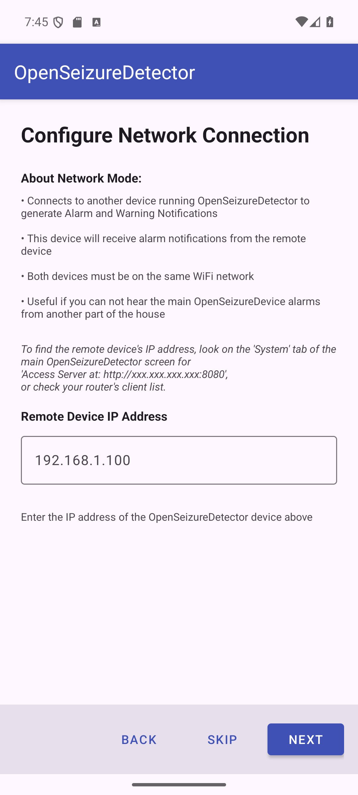

# Network Mode — Data Source Setup

<a href="index.html" class="btn-back">← Back to Main Setup Guide</a>

This page covers configuring **Network (Remote Monitoring)** as your data source
(Step 3 of the setup wizard). Network mode lets a second Android phone or tablet receive
alarm notifications from an existing OpenSeizureDetector installation on a primary device.

## How Network Mode Works

```
[PineTime / Garmin watch]
         |
         | Bluetooth
         v
[Primary phone running OSD]  <-- detects seizures, raises alarms
         |
         | Wi-Fi (same local network)
         v
[This phone in Network mode] <-- receives alarm notifications remotely
```

Both devices must be on the **same Wi-Fi network**.

You will need:
- A **second** Android phone or tablet running Android 8.0 or later
- An **existing** OpenSeizureDetector installation on a primary device (with a watch connected)
- Both devices on the same Wi-Fi network
- The IP address of the primary device (see below)

In the app, you should be on the *Configure Network Connection* screen.

### Finding the Primary Device IP Address

On the primary phone, open OpenSeizureDetector and look at the **System** tab. You will see
a line like:

    Access Server at: http://192.168.1.50:8080

The four numbers separated by dots (e.g. `192.168.1.50`) are the IP address you need.
Alternatively, find the IP address in your router's connected devices list.

---

## Configure Network Connection

The network configuration screen asks for the IP address of the primary device.

### Empty state (before entering IP)

[](images/03_datasource_config_network_empty.png){:target="_blank"}

The screen explains:
- This device will receive alarm notifications from the remote (primary) device
- Both devices must be on the same Wi-Fi network
- No seizure detection algorithms run on this device — those run on the primary device

### Entering the IP address

Tap the IP address field and type the IP address of the primary device.

[](images/03b_datasource_config_network_validated.png){:target="_blank"}

As you type a valid IP address (four numbers separated by dots, e.g. `192.168.1.50`),
the app automatically attempts to connect to the primary device on port 8080.

**Validation results:**

| Status | Meaning |
|--------|---------|
| Green: *Server validated successfully* | Connected — tap Next to continue |
| Orange: *Cannot reach server* | Check IP address and that both devices are on the same Wi-Fi |
| Red: *Invalid IP address format* | The address format is wrong — check you have typed it correctly |

A **Retry** button appears if validation fails — tap it after checking your settings.

**Note:** The **Next** button only becomes enabled once the primary device is successfully
reached. Algorithm selection is skipped entirely in Network mode — the algorithms are
configured on the primary device.

Press **Next** once validation succeeds (shown in green).

---

Once the network connection is validated and you have pressed **Next**, your data source
setup is complete. Return to the main setup guide for the setup completion screen.

> **Network mode reminder:** Algorithm selection is skipped — jump to
> [Setup Complete](index.html#step-5--setup-complete) on the main setup page.

<a href="index.html#step-5--setup-complete" class="btn-back">← Back to Main Setup — proceed to Setup Complete</a>

---

## Important Notes

- The **primary device** must have OpenSeizureDetector running and connected to the watch
  at all times for remote monitoring to work
- If the Wi-Fi connection is lost, the secondary device will show a connection error
- The secondary device does **not** need a watch connected
- Alarm sensitivity and algorithm settings are controlled only on the primary device
- All settings can be changed at any time from the **Settings** menu

---

## Troubleshooting

| Problem | Solution |
|---------|----------|
| Cannot reach server | Confirm both phones are on the same Wi-Fi network (not mobile data) |
| IP address keeps changing | Set a static IP (DHCP reservation) for the primary phone in your router settings |
| Alarm notifications not appearing | Check Android notification permissions for OpenSeizureDetector on this device |
| Validation succeeds but no alarms received | Ensure OSD is running and connected to the watch on the primary device |
| Connection drops overnight | Disable Wi-Fi sleep/power-saving on both devices |

For more information visit [openseizuredetector.org.uk](https://openseizuredetector.org.uk)
