# PineTime Watch — Data Source Setup

<a href="index.html" class="btn-back">← Back to Main Setup Guide</a>

This page covers configuring the **PineTime watch** as your data source (Step 3 of the
setup wizard). The PineTime is a low-cost, open-source wrist watch specifically supported by OpenSeizureDetector
for reliable tonic-clonic seizure detection.

You will need:
- A PineTime watch (available from [Pine64](https://www.pine64.org/pinetime/))
- Bluetooth enabled on your phone

In the OpenSeizureDetector phone app, you should be on the *Configure PineTime Watch* setup wizard screen.

---

## Configure PineTime Watch

The PineTime configuration screen guides you through three sub-steps.

{:target="_blank"}

### 3.1 - Install the PineTime Updater App

The **PineTime Updater** companion app is needed to flash the OpenSeizureDetector firmware
onto your watch.

- If the updater is **not installed**: an **Install PineTime Updater App** button appears.
  Tap it to open Google Play, install the app, then press Back to return here.
- If it is **already installed**: you will see a green tick:
  *PineTime Updater app is installed*.

### 3.2 - Install OpenSeizureDetector Firmware onto the Watch

Tap **Install PineTime Firmware** to launch the PineTime Updater app.

**Note:** The updater will request Bluetooth permissions and a notification permission.
Please grant both so the firmware transfer can complete.

**Step-by-step using the PineTime Updater:**

**3.2.1. App opens — three buttons are shown**

[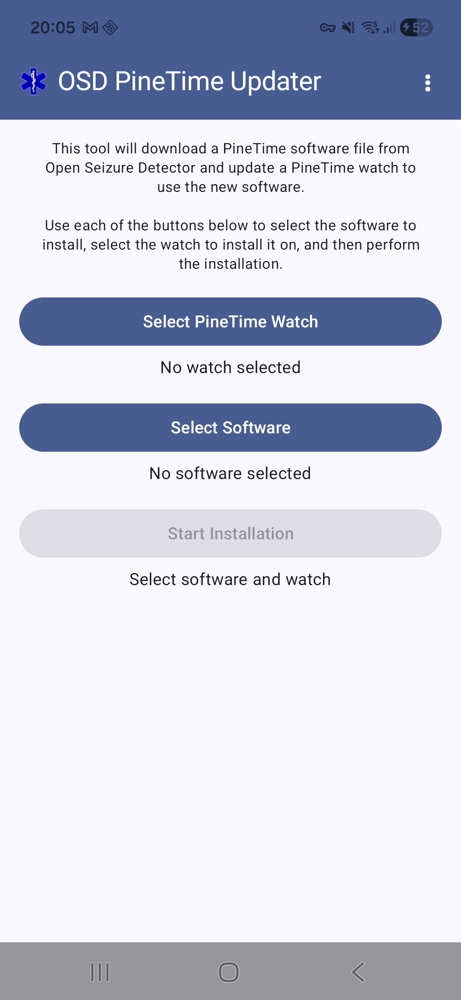](images/updater_01_main.png){:target="_blank"}

The app shows *Select PineTime Watch*, *Select Software*, and *Start Installation*. Start
by tapping **Select PineTime Watch**.

---

**3.2.2. Scan for your watch**

[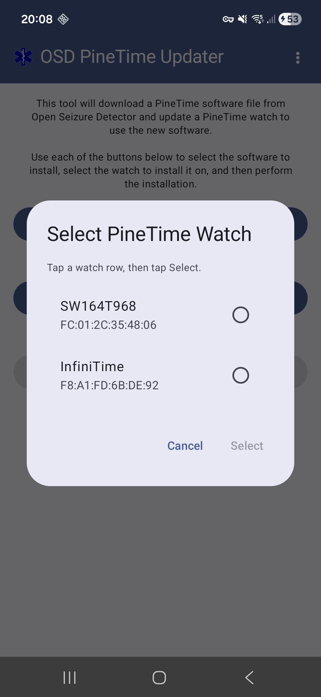](images/updater_02_watch_dialog_scan.png){:target="_blank"}

A dialog lists nearby Bluetooth devices. Look for **InfiniTime** (the name used by a
factory-fresh PineTime). Tap the InfiniTime row to select it.

---

**3.2.3. Select the InfiniTime row and tap Select**

[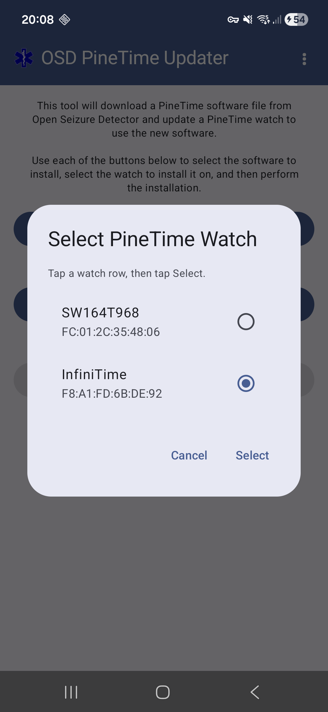](images/updater_03_watch_dialog_select.png){:target="_blank"}

The radio button beside InfiniTime fills. Tap **Select** to confirm.

---

**3.2.4. Watch confirmed — now choose the software**

[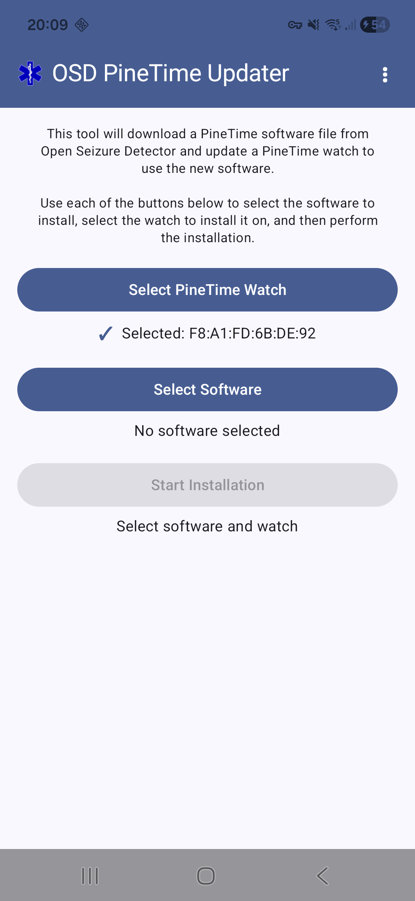](images/updater_04_watch_confirmed.png){:target="_blank"}

The main screen shows *✓ Selected: &lt;MAC address&gt;*. Now tap **Select Software**.

---

**3.2.5. Choose OpenSeizureDetector firmware**

[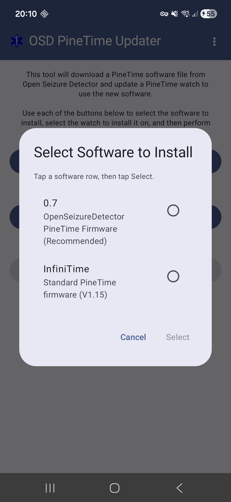](images/updater_05_software_dialog.png){:target="_blank"}

The software dialog shows two options. Tap the **0.7 OpenSeizureDetector PineTime Firmware
(Recommended)** row.

---

**3.2.6. OSD firmware selected — tap Select**

[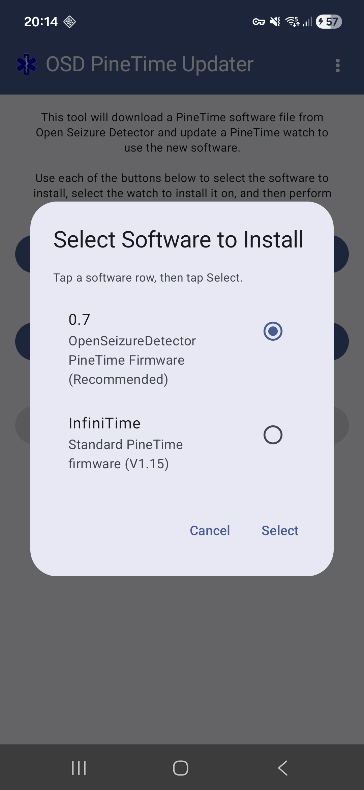](images/updater_06_software_osd_selected.png){:target="_blank"}

The radio button beside the OSD firmware fills and the **Select** button becomes active.
Tap **Select** to confirm.

---

**3.2.7. Ready to install**

[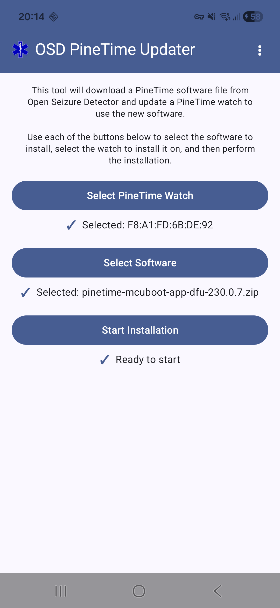](images/updater_07_ready_to_install.png){:target="_blank"}

Both watch and software sections now show a ✓. The status reads *Ready to start*. Tap
**Start Installation**.

---

**3.2.8. Installation in progress**

[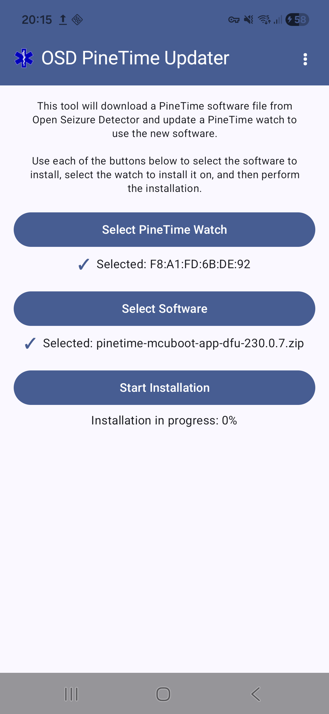](images/updater_08_installing.png){:target="_blank"}

The firmware is transferred over Bluetooth. Keep the phone close to the watch and wait
(about 2 minutes). The percentage climbs to 100%.

---

**3.2.9. Installation successful**

[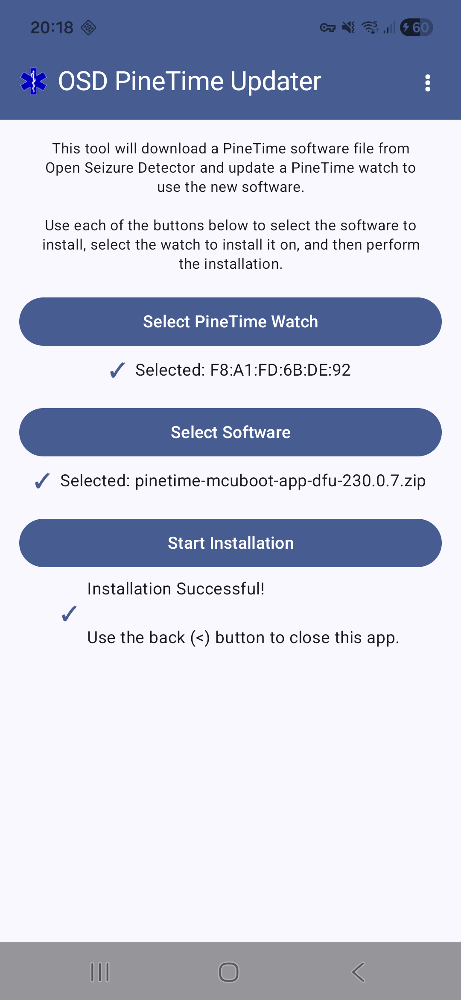](images/updater_09_complete.png){:target="_blank"}

*Installation Successful!* is displayed. Use the back button (**&lt;**) to close the updater
and return to the OpenSeizureDetector app using the phone 'Back' button.

After the firmware has been installed the PineTime will reboot and show the new clock face.    The installation is only temporary until it is validated as described in Section 3.4 below.

---

### 3.3 - Connect (Scan) for the Watch

If you have just installed the watch software using the instructions above, the watch bluetooth address should be pre-populated so there is no need to scan for the watch again.     

If the watch address is not shown, tap **Scan for PineTime Watch** to search for your watch over Bluetooth. A list of nearby
Bluetooth devices appears - select your PineTime (which is likely to be listed as 'InfiniTime').

Once selected, the screen shows the device name and MAC address in green, for example:

    PineTime   MAC: AB:CD:EF:12:34:56

If *No device selected* is shown in orange, go back and scan again.

Press **Next** when your watch appears in green.

---

### 3.4 - Validate the Firmware on the Watch

After the firmware has been installed the PineTime will reboot and show the new clock face.
You must **validate** the firmware on the watch itself — this tells the watch to keep the new
firmware permanently. If you skip this step the watch will fall back to the previous firmware
after its next restart.

**1. Wake the watch screen**

[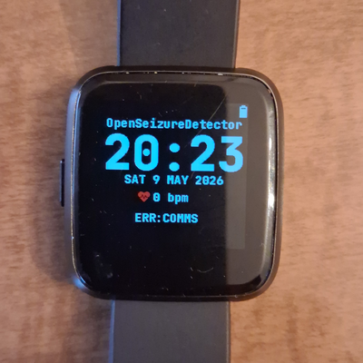](images/watch_01_wake.png){:target="_blank"}

Press the side button to wake the screen. You should see the OSD clock face showing the time,
date, and heart rate.

---

**2. Swipe right to open the app menu**

[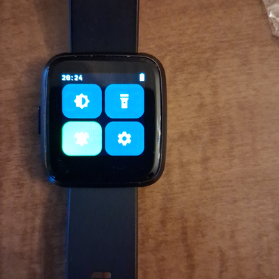](images/watch_02_menu.png){:target="_blank"}

Swipe the screen from left to right. A menu appears with four icons — including a **cog
(settings)** icon at the top right.

---

**3. Tap the cog icon to open Settings**

[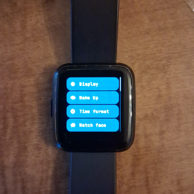](images/watch_03_settings.png){:target="_blank"}

Tap the cog icon. The settings list opens, showing Display, Wake Up, Time Format, Watch
Face and other options.

---

**4. Scroll down to find Firmware**

[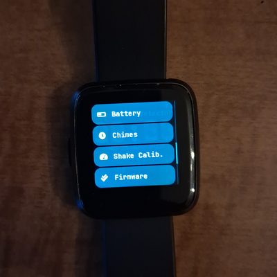](images/watch_04_settings_firmware.png){:target="_blank"}

Swipe the screen upwards to scroll through the settings list. Continue until you can see the
**Firmware** entry (after Battery, Chimes, and Shake Calib.).

---

**5. Tap Firmware — then tap Validate**

[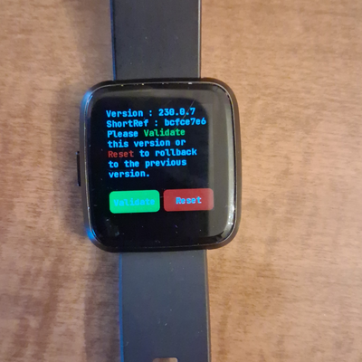](images/watch_05_validate_page.png){:target="_blank"}

Tap **Firmware** to open the firmware management screen. It shows the version number and
short reference of the installed firmware, along with two buttons:

- **Reset** (red) — reverts to the previous firmware
- **Validate** (green) — permanently accepts the new firmware

Tap **Validate** to confirm the new firmware.

Press the side button to return to the clock face

---

Now return to the main setup guide to continue with algorithm selection.

<a href="index.html#step-4--select-detection-algorithms" class="btn-back">← Back to Main Setup — continue with algorithm selection</a>

---

## Troubleshooting

| Problem | Solution |
|---------|----------|
| Watch not found during scan | Ensure watch is charged, and phone Bluetooth is enabled.  Wake up the bluetooth radio by pressing and releasing the watch button. |
| Firmware update fails | Keep watch within 1 metre of phone during the update |
| App not connecting after setup | Force-stop the app and restart; or re-scan via Settings → Bluetooth.   Re-boot the watch by pressing and holding the watch button for about 10 seconds, until the pinecone logo appears, then release the button |
| PineTime Updater not on Play Store | Check your regional store or see the OpenSeizureDetector [GitHub releases](https://github.com/OpenSeizureDetector/Android_PineTime_Updater/releases) page |

For more information visit [openseizuredetector.org.uk](https://openseizuredetector.org.uk) or
contact graham@openseizuredetector.org.uk
