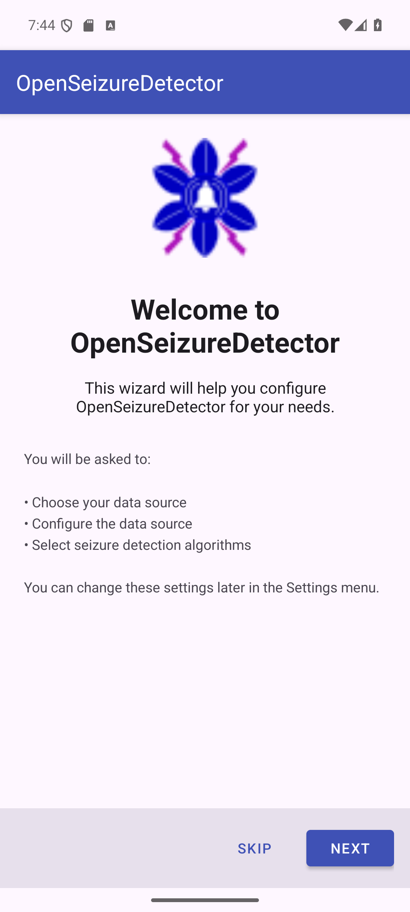
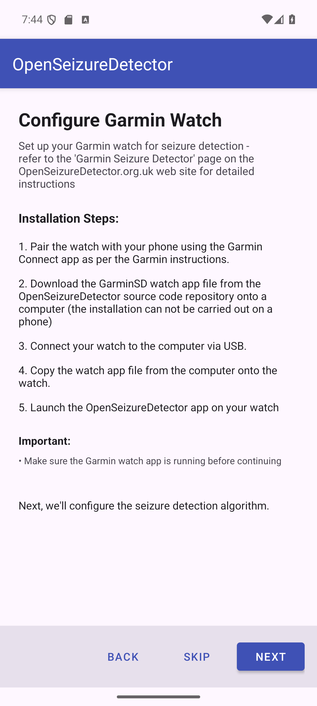
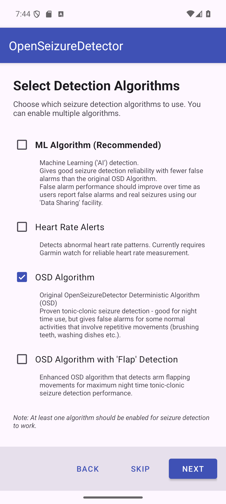
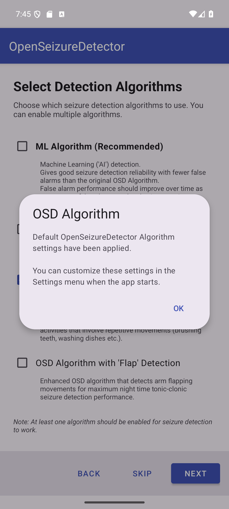

# Setting Up OpenSeizureDetector with a Garmin Watch

> **New users:** If you do not already own a Garmin watch, consider trying the low-cost
> (approx. £35) [PineTime watch](https://pine64.com/product/pinetime-smartwatch-sealed/)
> first — it is cheaper and much easier to set up.  See the [PineTime setup guide](../setup_pinetime/)
> for details.  The main reason to prefer a Garmin watch is if you need the **heart rate alarm**
> functionality, because Garmin's HR sensors are significantly more reliable than PineTime's
> during vigorous movement.

This guide walks you through setting up OpenSeizureDetector using a **Garmin** smartwatch.
A Garmin watch provides reliable tonic-clonic seizure detection and, unlike the PineTime,
also delivers accurate continuous heart rate monitoring.

## Overview

OpenSeizureDetector works on Garmin smartwatches that support ConnectIQ apps. It monitors
the movement of the wearer's arm and raises an alarm if shaking similar to a tonic-clonic
seizure is detected for more than 10 seconds. It can also raise an alarm if the measured
heart rate goes outside specified limits.

The watch sends raw acceleration and heart rate data to the phone, which analyses it and
generates alarms locally (the phone beeps), via Wi-Fi to another device in the house, or
by sending an SMS text message with the user's location.

## Compatible Devices

OpenSeizureDetector works with Garmin smartwatches that support ConnectIQ SDK level 2.3 or
higher. Garmin's [Compatible Devices](https://developer.garmin.com/connect-iq/compatible-devices/)
page lists which watches support which SDK level.

A list of devices known to work is maintained at:
[openseizuredetector.org.uk — Compatible Devices](https://www.openseizuredetector.org.uk/?page_id=1324#Compatible_Devices)

**Known issues with specific models:**
- **VenuSQ / VenuSQ 2** — avoid these; there is a known issue with the app stopping after
  several hours.
- **Vivoactive 5** — users have reported difficulties; avoid for now.

If you are buying a watch specifically for OpenSeizureDetector, purchase from a retailer
that accepts returns in case it does not work as expected.

**Phone requirements:** The phone must run the
[Garmin Connect app](https://play.google.com/store/apps/details?id=com.garmin.android.apps.connectmobile)
(requires Android 7 or higher, full Android — not the 'Go' edition). Avoid Huawei and
Xiaomi phones due to known security feature incompatibilities.

## Before You Start

You will need:
- An Android phone running Android 7.0 or later (full Android, not Android Go)
- A compatible Garmin watch (see Compatible Devices above)
- The **[Garmin Connect](https://play.google.com/store/apps/details?id=com.garmin.android.apps.connectmobile)** app installed on your phone
- A **computer with a USB port** (required to copy the watch app file onto the watch)

**Important:** The Garmin watch app file must be copied to the watch via a USB connection
from a computer — this step cannot be done on a phone alone.

---

## Step 1 - Welcome Screen

When you first install and launch OpenSeizureDetector, the setup wizard starts automatically.

{:target="_blank"}

The wizard guides you through:
- Choosing your data source (the watch)
- Configuring the data source
- Selecting seizure detection algorithms

Press **Next** to continue, or **Skip** to configure manually via Settings later.

---

## Step 2 - Choose Data Source

On the *Choose Data Source* screen, select **Garmin Watch**.

{:target="_blank"}

| Option | Description |
|--------|-------------|
| Phone (Demo Mode) | Uses the phone accelerometer - for testing only, not real seizure detection |
| PineTime Watch (Recommended) | Low-cost wrist watch - reliable seizure detection |
| **Garmin Watch** | Garmin smart watch - seizure detection plus heart rate monitoring |
| Network (Remote Monitoring) | Receives alarms from another OSD device on your Wi-Fi |

Press **Next** to continue.

---

## Step 3 - Configure Garmin Watch

The Garmin configuration screen summarises the steps needed to set up your watch.

{:target="_blank"}

Work through each sub-step below before pressing **Next**.

### Step 3-1 - Pair the Watch with Garmin Connect

Pair your Garmin watch with your Android phone using the **Garmin Connect** app, following
Garmin's standard pairing instructions for your watch model. This establishes the Bluetooth
link between the phone and watch that OpenSeizureDetector uses.

Once paired, verify that Garmin Connect is successfully receiving data from the watch before
continuing.

**Disable watch notifications:** Garmin Connect forwards phone notifications (emails, SMS,
etc.) to the watch. This interferes with seizure detection data transfer and should be
disabled. In the Garmin Connect app, go to **Settings → Notifications → App Notifications**
and disable all app notifications.

### Step 3-2 - Install the OpenSeizureDetector Android App

If you have not already done so, install the latest version of the OpenSeizureDetector
Android app from [Google Play](https://play.google.com/store/apps/details?id=uk.org.openseizuredetector).

**Important battery setting:** On your phone, search for **"Optimise Battery Usage"** in
Settings and make sure OpenSeizureDetector is set to **Not optimised** — otherwise the
Android system may shut it down to save power.

Also open Garmin Connect and go to **Settings → Notifications → App Notifications** and
ensure that notifications from OpenSeizureDetector are **disabled** in Garmin Connect
(to prevent watch buzzing that interferes with data transfer).

### Step 3-3 - Install the GarminSD Watch App

There is a [video walkthrough on YouTube](https://youtu.be/modxwJLAFjQ) of the steps
below (note: it is slightly out of date, so read the steps here too):

<iframe width="560" height="315" src="https://www.youtube.com/embed/modxwJLAFjQ" title="GarminSD watch app installation" frameborder="0" allow="accelerometer; autoplay; clipboard-write; encrypted-media; gyroscope; picture-in-picture; web-share" referrerpolicy="strict-origin-when-cross-origin" allowfullscreen></iframe>

1. **Download the watch app** — on a computer, download the latest `GarminSD.prg` file
   from the [GarminSD releases page](https://github.com/OpenSeizureDetector/Garmin_SD/releases/latest)
   on GitHub.
   - If the latest release does not work on your watch, try the `v2.0.7x` variant (compiled
     with newer Garmin tools; works on newer watches but not some older models).

2. **Connect the watch to the computer** via its charging/data USB cable. The watch
   appears as a removable drive.

3. **Copy the file onto the watch** — open the watch drive and copy `GarminSD.prg` into
   the `GARMIN/APPS` folder. Create the folder if it does not exist.
   - On some older watches, the file must be renamed to exactly `GarminSD.prg` (i.e.
     remove any version number from the filename) or it will not appear in the apps list.

4. **Safely eject the watch** and disconnect the USB cable.

5. **Verify the app is present** — on the watch, navigate to the full apps list. You
   should see **GarminSD** in the list.

6. **Start the GarminSD app** on the watch — the heart rate reading should update every
   second. See [Starting the Watch App](#starting-the-watch-app) below for detailed
   button-press instructions.

Press **Next** in the phone app once the GarminSD watch app is confirmed running.

---

## Step 4 - Select Detection Algorithms

Choose which seizure detection algorithms to enable. You can select **more than one**.

{:target="_blank"}

| Algorithm | Description |
|-----------|-------------|
| **ML Algorithm (Recommended)** | Machine Learning / AI detection. Good sensitivity, fewer false alarms. Improves over time via community data sharing. |
| **Heart Rate Alerts** | Detects abnormal heart rate patterns. Garmin provides reliable continuous HR - highly recommended with a Garmin watch. |
| **OSD Algorithm** | Original proven algorithm. Good for overnight use; may false-alarm on repetitive movements (brushing teeth, washing dishes etc.). |
| OSD with Flap Detection | Enhanced OSD that also detects arm flapping for maximum night-time tonic-clonic detection. |

**At least one algorithm must be selected** before Next is enabled.

**Recommended choice for Garmin:**
- ML Algorithm - best balance of sensitivity and false-alarm rate
- Heart Rate Alerts - key advantage of a Garmin; uses the watch built-in HR sensor
- OSD Algorithm - proven reliable backup, especially overnight

### Algorithm configuration dialogs

After pressing Next, a short confirmation dialog appears for each enabled algorithm:

{:target="_blank"}

- **OSD Algorithm** - default settings applied. Tap **OK**.
- **OSD with Flap Detection** - default settings applied. Tap **OK**.
- **ML Algorithm** - the recommended ML model is downloaded automatically. If unavailable,
  ML is gracefully disabled and can be re-enabled from Settings once a model is available.
- **Heart Rate Alerts** - default HR thresholds are applied. Tap **OK**.
  You can fine-tune these thresholds in Settings after the wizard completes.

---

## Step 5 - Setup Complete

The final screen confirms your configuration.

{:target="_blank"}

The summary shows:
- **Data Source** - Garmin Watch
- **Enabled Algorithms** - the algorithms that will run

Press **Get Started** to launch the main monitoring screen.

---

## What Happens Next

1. OpenSeizureDetector starts its background monitoring service
2. The Garmin watch app must be running on the watch for the phone to receive data
3. Wrist movement and heart rate data stream continuously to the phone
4. If a seizure pattern or abnormal heart rate is detected, the app raises an alarm and
   (if configured) sends notifications to your carers

All settings can be changed at any time from the **Settings** menu - you do not need to
re-run the wizard.

---

## Heart Rate Alert Configuration

Because Garmin provides reliable heart rate data, review the default HR alert thresholds
in Settings after setup:

| Setting | Default | Description |
|---------|---------|-------------|
| Max Heart Rate | 120 bpm | Alert if HR exceeds this value |
| Min Heart Rate | 40 bpm | Alert if HR drops below this value |

Adjust these to suit the person being monitored, based on advice from their medical team.

---

## Starting the Watch App

The exact button layout varies by Garmin model. The instructions below are for the
**Vivoactive 3** — adapt as needed for your watch.

Once GarminSD.prg is installed and the watch is disconnected from the computer:

1. Press the **main side button** to open the list of favourite apps.
2. Scroll up until you see the **four-dots grid icon** and press it to open the full app list.
3. Scroll to the bottom of the list — **GarminSD** should appear there.
4. Tap **GarminSD** to launch it.

When the app starts, it displays the version number for the first 5–10 seconds, then
switches to showing the seizure detector status (**OK / WARNING / ALARM / FAULT**) and
a live heart rate reading updated every second.

### Adding GarminSD to Your Favourites

To make the app easier to start each day, add it to your favourites list:

1. From the main watch face, press the main button to open the favourites list.
2. Press and hold one of the app icons and select **Manage Apps**.
3. Scroll to **GarminSD** and select it, then choose **Add Favourite**.
4. Optionally remove less-used apps from the list to keep it short.

GarminSD will now appear directly in the favourites list with a single button press.

---

## Troubleshooting

| Problem | Solution |
|---------|----------|
| Watch app not found on USB drive | Navigate to the `GARMIN/APPS` folder on the watch drive; create it if it does not exist |
| GarminSD does not appear in watch app list | Rename the file to exactly `GarminSD.prg` (remove any version number) and re-copy |
| App shows `FAULT` status | Ensure GarminSD is actively running on the watch, then restart OSD on the phone |
| Phone shows *Connecting* indefinitely | Re-launch GarminSD on the watch; restart OSD on the phone |
| Heart rate not displayed | Wear the watch snugly; ensure the HR sensor window on the back is clean |
| Garmin Connect pairing fails | Follow Garmin's official pairing instructions for your specific watch model |
| Watch keeps buzzing with notifications | Disable App Notifications for OpenSeizureDetector in Garmin Connect Settings |
| OSD shut down by Android in background | Set OSD to *Not optimised* in your phone's Battery Optimisation settings |
| Watch appears to work then stops after hours | Avoid VenuSQ / VenuSQ2 models; try a different compatible Garmin model |

For the full troubleshooting procedure and FAQ (including watch error codes) see:
[openseizuredetector.org.uk](https://openseizuredetector.org.uk)

Please report issues or successes to graham@openseizuredetector.org.uk or the
[OpenSeizureDetector Facebook page](https://facebook.com/openseizuredetector).
