# Using OpenSeizureDetector Version 5

This page is a quick introduction to everyday use of OpenSeizureDetector (OSD) Version 5 after installation.

If you still need to install the app or set up your watch, start with the  [Setup Guide](setup/index.html).

## 1. Opening the app

When you open OSD after the initial set-up, it will briefly show checks while it connects to the background service and your selected data source.

[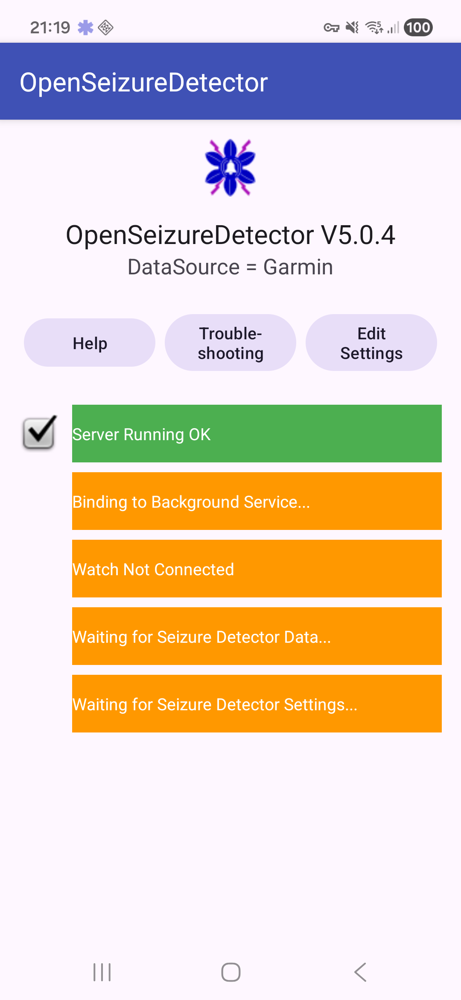](images/v5-introduction/startup_checks_v5.png){:target="_blank"}

OSD uses a background service, so monitoring can continue when the app is not in the foreground. You can switch apps or turn the screen off, and OSD stays active while the service is running.   

You can use the icon in the system bar at the top of the screen to reopen the OSD monitoring screen when required.

When the start-up checks are complete, OSD opens the monitoring interface.

## 2. Monitoring Interface - Basic Mode

Basic Mode presents a simple monitoring screen that 

  - shows the overall status of the system (OK, WARNING, ALARM or FAULT)
  - shows which of the enabled seizure detection algorithms are generating the alarms (OSD, ML etc.)
  - Provides a 'Mute Alarms' button that will prevent the system alarming for 10 minutes (in case you are doing something that you know will cause a false alarm).
  - Provides a 'Raise Alarm' button that will generate an alarm, even if the detection system has not detected a seizure.

[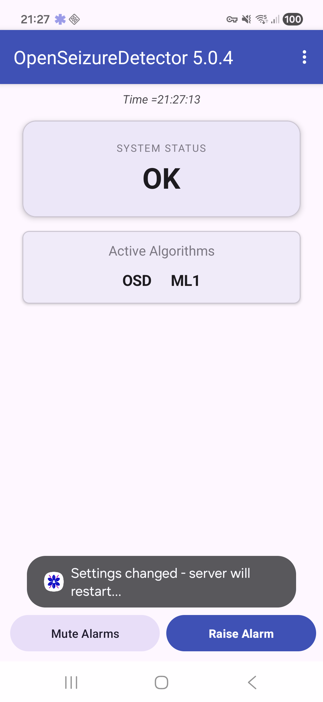](images/v5-introduction/main_basic_after_toggle_v5.png){:target="_blank"}

You can turn off Basic Mode if you want more information on the seizure detection status, and access to configuration settings.   Basic Mode is turned off as follows:

1. Open the menu (three dots) and tap **Settings**.
2. Open **General**.
3. Toggle **Basic Mode**.
4. Return to the main screen.

## 3. Main Monitoring Interface

In advanced mode, the main screen includes tabs and detailed status pages.

[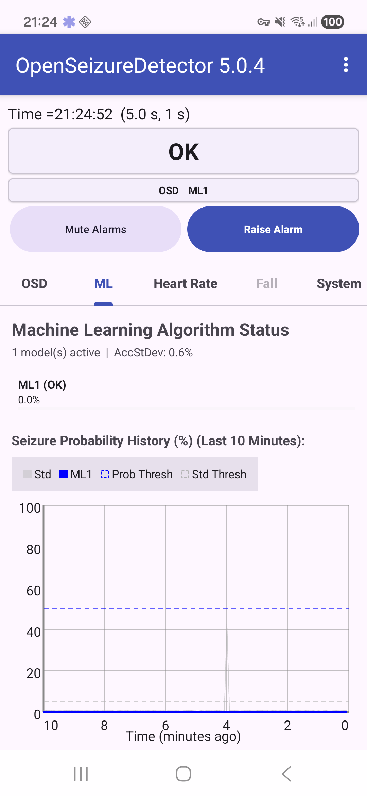](images/v5-introduction/main_after_wait_v5.png){:target="_blank"}

The overflow menu (three dots) gives quick access to common actions, including **Settings**.

[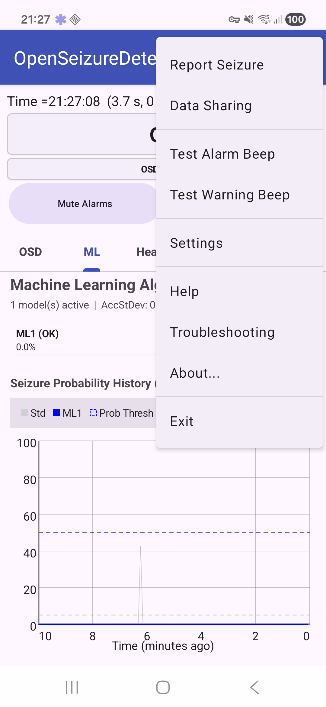](images/v5-introduction/main_menu_v5.png){:target="_blank"}

The tabs along the middle of the screen show different views of the monitoring system:

### OSD tab

The **OSD** tab shows the status of the original OpenSeizureDetector algorithm. It displays the current power and spectrum measurements, the current seizure probability, and a chart of the recent signal values.

[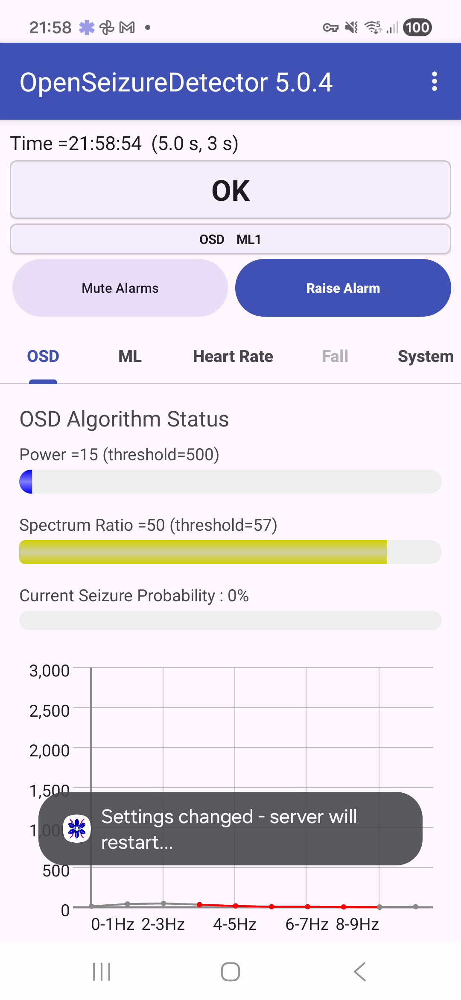](images/v5-introduction/tab_osd_v5.png){:target="_blank"}

### ML tab

The **ML** tab shows the machine-learning detector status. It tells you which ML model is active, whether it is currently OK, and shows the recent seizure probability history.

[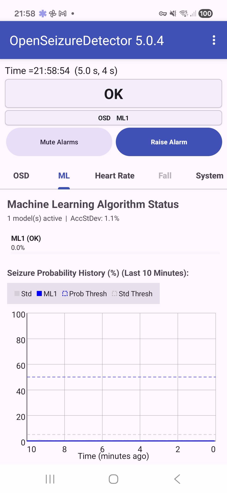](images/v5-introduction/tab_ml_v5.png){:target="_blank"}

### Heart Rate tab

The **Heart Rate** tab shows the current heart rate, the values being used by the heart-rate alarm checks, and a recent history graph. This tab is most useful when heart-rate alarms are enabled and your watch is providing heart-rate data.

[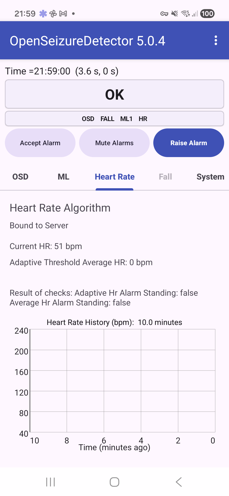](images/v5-introduction/tab_heart_rate_v5.png){:target="_blank"}

### Fall tab

The **Fall** tab shows the fall-detection status, the current acceleration window values, the configured thresholds, and the recent fall-acceleration history graph.

[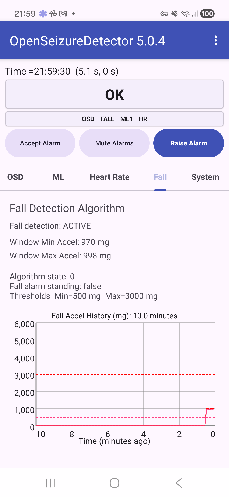](images/v5-introduction/tab_fall_v5.png){:target="_blank"}

### System tab

The **System** tab shows connection and system information, including server status, the current data source, watch status, and history charts such as signal strength and battery level. It also provides shortcuts to **Edit Settings** and **View System Logs**.

[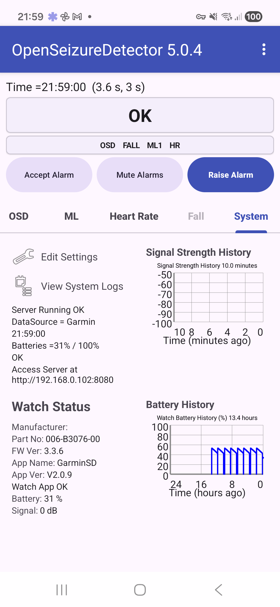](images/v5-introduction/tab_system_v5.png){:target="_blank"}

## 4. Settings pages

The settings pages are accessed by selecting **Settings** in the main screen menu.   Settings are grouped in categories:

[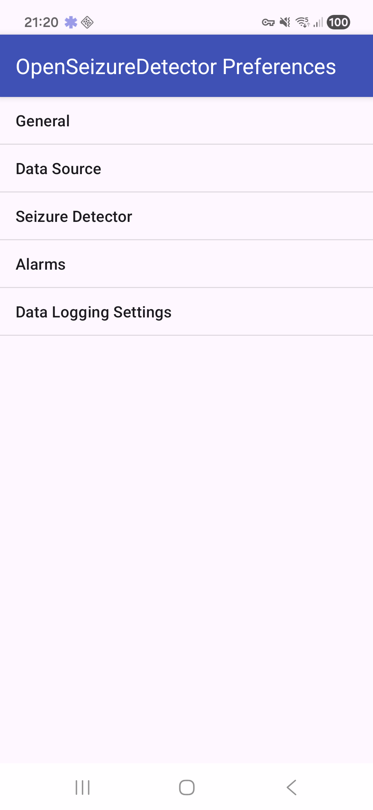](images/v5-introduction/settings_headers_v5.png){:target="_blank"}

General settings include the **Basic Mode** switch and app behavior options:

[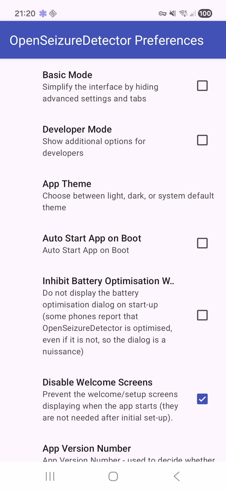](images/v5-introduction/settings_general_v5.png){:target="_blank"}

Data source settings show the selected watch/app source:

[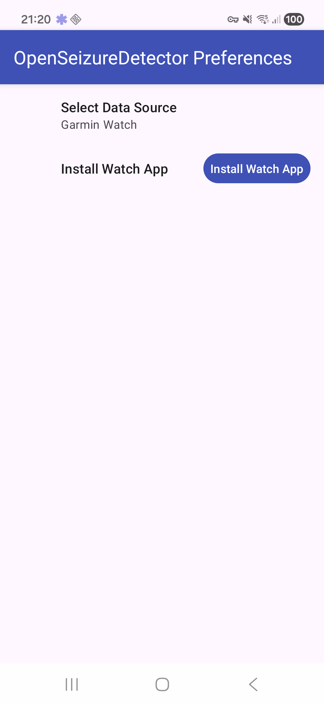](images/v5-introduction/settings_datasource_v5.png){:target="_blank"}

Seizure detector settings control active seizure detection algorithms and related options:

[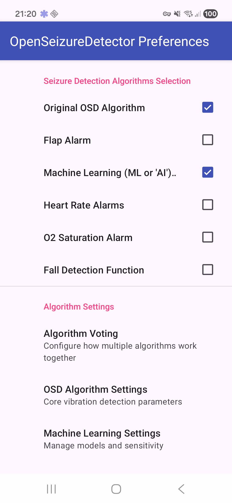](images/v5-introduction/settings_seizure_detector_v5.png){:target="_blank"}

The Alarms  settings page allows you to select how the system will generate alarms, including by sending SMS text messages if required.

## 5. Stopping and restarting monitoring

To stop monitoring:

1. Open the menu (three dots).
2. Tap **Exit**.
3. A 'Shutting Down' box should appear briefly and the app will close, including removing the notification icon from the system bar at the top of the screen.

To restart later, use the launcher icon on the device.
